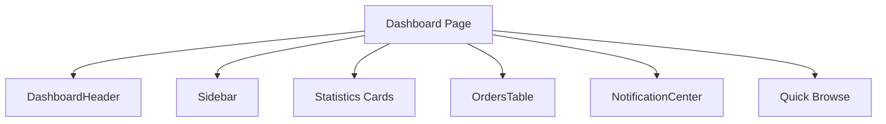
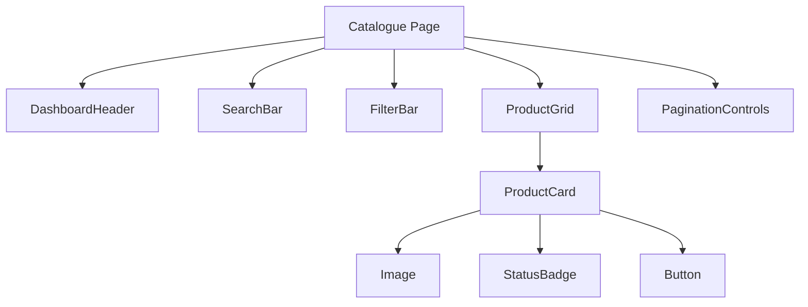
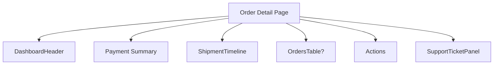
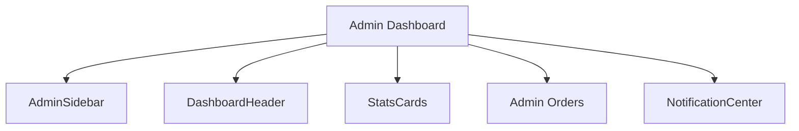
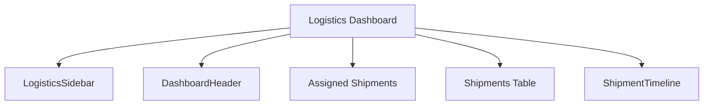

# Africhina Connect — Frontend Component Architecture

**Version:** 1.0
**Status:** Draft (Sprint 0.5 — UX & System Validation)
**Author:** Lead Frontend Architect / React Component Designer
**Audience:** Frontend Developers, AI Coding Assistants
**Tech Stack:** Next.js (App Router), React, JavaScript, Tailwind CSS, shadcn/ui
**Methodology:** Atomic Design + Clean Architecture

> This document defines every reusable UI component before implementation. It aligns with `docs/design-system.md` (visual language) and `docs/screens.md` (screen inventory). No application code is generated in this sprint.

---

## Principles

- **Atomic Design:** Components are composed bottom-up: Atoms → Molecules → Organisms → Templates → Pages.
- **Clean Architecture:** UI components are presentational; data fetching lives in application layer / server components. Components never import infrastructure directly.
- **Reuse & no duplication:** shared primitives live once in `components/ui`; domain composites in `components/<module>`.
- **Server-first:** prefer React Server Components for data; use Client Components only for interactivity.
- **Accessible & consistent:** every component follows design-system tokens and accessibility rules.

---

# 1. Atoms

Basic, indivisible building blocks. Each atom is framework-agnostic regarding business logic.

### Button

- **Purpose:** Trigger an action.
- **Props:** `variant`, `size`, `loading`, `disabled`, `icon`, `iconPosition`, `onClick`, `type`, `children`, `ariaLabel`.
- **States:** default, hover, pressed, focus, disabled, loading.
- **Variants:** primary, secondary, outline, ghost, danger, success.
- **Accessibility:** `type` default `button`; `aria-label` when icon-only; `disabled` prevents focus; loading announces via `aria-busy`.

### Input

- **Purpose:** Single-line text entry.
- **Props:** `type`, `value`, `onChange`, `placeholder`, `label`, `error`, `success`, `disabled`, `required`, `name`.
- **States:** default, focus, error, success, disabled.
- **Variants:** text, password, email, phone, search, number.
- **Accessibility:** label linked via `htmlFor`; inline error with `aria-describedby`; `aria-invalid` when error.

### Label

- **Purpose:** Describe a form field.
- **Props:** `htmlFor`, `required`, `children`, `size`.
- **Accessibility:** always associated with a control.

### Badge

- **Purpose:** Short label near content.
- **Props:** `variant`, `children`, `size`.
- **Variants:** neutral, success, warning, error, info, accent.
- **Accessibility:** decorative unless conveying status → pair with `StatusBadge`.

### Avatar

- **Purpose:** Represent a user.
- **Props:** `src`, `alt`, `size`, `fallback`, `status`.
- **Variants:** sizes 24/32/40/48px; optional presence dot.
- **Accessibility:** `alt` text; fallback initials.

### Spinner

- **Purpose:** Indicate loading.
- **Props:** `size`, `label`.
- **Accessibility:** `role="status"` + `aria-label`.

### Icon

- **Purpose:** Display a Lucide icon.
- **Props:** `name`, `size`, `strokeWidth`, `className`.
- **Accessibility:** decorative by default (`aria-hidden`); meaningful icons need `aria-label`.

### Divider

- **Purpose:** Separate content.
- **Props:** `orientation`, `spacing`.
- **Variants:** horizontal, vertical.

### Tooltip

- **Purpose:** Provide context on hover/focus.
- **Props:** `content`, `side`, `children`, `delay`.
- **Accessibility:** requires focus trigger; `role="tooltip"`.

### Checkbox

- **Purpose:** Select multiple options.
- **Props:** `checked`, `onChange`, `label`, `indeterminate`, `disabled`.
- **Accessibility:** native input + label association.

### Radio

- **Purpose:** Select one option from a set.
- **Props:** `name`, `value`, `checked`, `onChange`, `label`, `disabled`.
- **Accessibility:** grouped with `role="radiogroup"`.

### Switch

- **Purpose:** Toggle binary state.
- **Props:** `checked`, `onChange`, `label`, `disabled`.
- **Accessibility:** `role="switch"`, `aria-checked`.

### Progress

- **Purpose:** Show completion/status amount.
- **Props:** `value`, `max`, `variant`, `label`.
- **Variants:** linear, circular.
- **Accessibility:** `role="progressbar"`, `aria-valuenow`.

### Skeleton

- **Purpose:** Placeholder while loading.
- **Props:** `width`, `height`, `variant`, `repeat`.
- **Accessibility:** `aria-hidden`; wrapped in `aria-busy` container.

### Status Dot

- **Purpose:** Semantic status indicator.
- **Props:** `status`, `pulse`, `label`.
- **Alt:** conveys color; always paired with text label.

---

# 2. Molecules

Composites of atoms that form a single reusable unit.

### SearchBar

- **Purpose:** Query a list.
- **Children:** Input, Icon, Button(optional).
- **Props:** `value`, `onChange`, `onSearch`, `placeholder`, `debounceMs`.
- **Events:** `onSearch`, `onChange`.

### LoginForm

- **Purpose:** Authenticate a user.
- **Children:** Input(email), Input(password), Checkbox(remember), Button, Link(forgot).
- **Props:** `onSubmit`, `loading`, `error`.
- **Events:** `onSubmit(email, password)`.

### ProductCard

- **Purpose:** Display product summary.
- **Children:** Image, Badge, Text, Button, StatusBadge.
- **Props:** `product`, `onRequestQuote`, `onView`.
- **Events:** `onRequestQuote`, `onView`.

### RFQCard

- **Purpose:** Display RFQ summary.
- **Children:** Text, StatusBadge, Badge, Button.
- **Props:** `rfq`, `onView`.
- **Events:** `onView`.

### ShipmentCard

- **Purpose:** Display shipment summary.
- **Children:** Text, StatusBadge, Timeline(mini), Button.
- **Props:** `shipment`, `onTrack`.
- **Events:** `onTrack`.

### UserMenu

- **Purpose:** Account actions.
- **Children:** Avatar, Dropdown, MenuItem, Button.
- **Props:** `user`, `onLogout`, `onProfile`.
- **Events:** `onLogout`, `onProfile`, `onSettings`.

### NotificationItem

- **Purpose:** Show a single notification.
- **Children:** Icon, Text, Badge(time), Button(mark read).
- **Props:** `notification`, `onOpen`, `onRead`.
- **Events:** `onOpen`, `onRead`.

### StatusBadge

- **Purpose:** Semantic status label with color.
- **Children:** StatusDot, Badge.
- **Props:** `status`, `label`.
- **Notes:** the canonical way to convey status (never color alone).

### FilterBar

- **Purpose:** Filter a list.
- **Children:** Select, Input, Button, Badge(chips).
- **Props:** `filters`, `onChange`, `onApply`, `onReset`.
- **Events:** `onChange`, `onApply`, `onReset`.

### PaginationControls

- **Purpose:** Navigate list pages.
- **Children:** Button(prev/next), Text, Button(page).
- **Props:** `page`, `totalPages`, `pageSize`, `onPageChange`.
- **Events:** `onPageChange`.

---

# 3. Organisms

Complex composites of molecules/atoms that render a meaningful section.

### Navbar (Top Navigation)

- **Composition:** Logo, NavLinks, SearchBar, NotificationBell, UserMenu.
- **Data:** session/user, unread count.
- **API:** `GET /api/notifications/unread-count`.
- **Loading:** skeleton for avatar/bell.
- **Error:** fallback to static nav.

### Sidebar

- **Composition:** NavLinks, SectionHeaders, CollapseToggle, Logout.
- **Data:** role, active route.
- **API:** none (route-driven).
- **Loading:** skeleton links.
- **Error:** none.

### DashboardHeader

- **Composition:** PageTitle, Breadcrumbs, Actions, SearchBar.
- **Data:** page title, breadcrumb trail.
- **API:** none.
- **Loading:** none.

### ProductGrid

- **Composition:** ProductCard[], FilterBar, SearchBar, PaginationControls, EmptyState.
- **Data:** products, filters, pagination.
- **API:** `GET /api/products`.
- **Loading:** skeleton cards.
- **Error:** ErrorState + retry.

### RFQList

- **Composition:** RFQCard[], FilterBar, PaginationControls, EmptyState, CreateButton.
- **Data:** rfqs, filters, pagination.
- **API:** `GET /api/rfqs`.
- **Loading:** skeleton.
- **Error:** ErrorState + retry.

### OrdersTable

- **Composition:** Table, SearchBar, FilterBar, StatusBadge[], BulkActions, PaginationControls.
- **Data:** orders, filters, selection, pagination.
- **API:** `GET /api/orders`.
- **Loading:** skeleton rows.
- **Error:** ErrorState + retry.

### ShipmentTimeline

- **Composition:** Timeline, StatusDot[], Text, MapView(mini).
- **Data:** shipment events.
- **API:** `GET /api/orders/:id/shipment`.
- **Loading:** skeleton timeline.
- **Error:** ErrorState.

### NotificationCenter

- **Composition:** NotificationItem[], FilterTabs, MarkAllRead, EmptyState.
- **Data:** notifications, filters.
- **API:** `GET /api/notifications`, `PUT .../read`.
- **Loading:** skeleton.
- **Error:** ErrorState.

### CustomerProfilePanel

- **Composition:** Avatar, Form, AddressBook, Tabs, SaveButton.
- **Data:** profile, addresses.
- **API:** `GET/PUT /api/profile`, `/api/addresses`.
- **Loading:** skeleton.
- **Error:** inline validation / ErrorState.

### PaymentSummary

- **Composition:** OrderSummary, Amount, PaymentMethodSelect, PayButton, StatusBadge.
- **Data:** order totals, payment methods.
- **API:** `POST /api/payments/initialize`.
- **Loading:** disable pay while submitting.
- **Error:** PaymentFailure UI.

### SupportTicketPanel

- **Composition:** ConversationThread, ReplyBox, AttachmentUpload, StatusBadge, EscalateButton.
- **Data:** ticket, replies.
- **API:** `GET/POST /api/support/tickets/:id`.
- **Loading:** skeleton thread.
- **Error:** ErrorState.

---

# 4. Templates

Page-level layouts with regions/slots. Templates own layout; pages inject content into slots.

### PublicLayout

- **Regions:** TopNav, Main, Footer.
- **Slots:** `children`.
- **Shared:** Navbar (public), Footer.
- **Responsive:** stacks vertically; nav collapses to hamburger.

### DashboardLayout (Customer)

- **Regions:** Sidebar, Header, Main, Notifications.
- **Slots:** `children`, `headerActions`.
- **Shared:** Sidebar, DashboardHeader, NotificationBell.
- **Responsive:** sidebar → bottom nav on mobile.

### AdminLayout

- **Regions:** Sidebar, Header, Main.
- **Slots:** `children`.
- **Shared:** Admin Sidebar, DashboardHeader.
- **Responsive:** sidebar collapsible.

### LogisticsLayout

- **Regions:** Sidebar, Header, Main.
- **Slots:** `children`.
- **Shared:** Logistics Sidebar, DashboardHeader.
- **Responsive:** sidebar → bottom nav.

### AuthenticationLayout

- **Regions:** LeftPanel(brand), RightPanel(form).
- **Slots:** `children`.
- **Shared:** Logo, background.
- **Responsive:** stacks; form full-width on mobile.

---

# 5. Pages (Mapping to screens.md)

| Page (Screen ID)                                                                                   | Template                                 |
| -------------------------------------------------------------------------------------------------- | ---------------------------------------- |
| SCR-001 Landing, SCR-002/012 Catalogue, SCR-003/013 Product Detail, SCR-004 About, SCR-005 Contact | PublicLayout                             |
| SCR-006 Login, SCR-007 Register, SCR-008 Forgot PW, SCR-009 Reset PW, SCR-010 Verify Email         | AuthenticationLayout                     |
| SCR-011 Customer Dashboard, SCR-014–020 RFQ/Order, SCR-027 Notifications, SCR-028/029 Profile      | DashboardLayout                          |
| SCR-030–032 Support (customer)                                                                     | DashboardLayout                          |
| SCR-033 Admin Login                                                                                | AuthenticationLayout                     |
| SCR-034–046 Admin sections                                                                         | AdminLayout                              |
| SCR-047–052 Logistics                                                                              | LogisticsLayout                          |
| SCR-053/054 Reports                                                                                | AdminLayout                              |
| SCR-055/056 Settings                                                                               | DashboardLayout (customer) / AdminLayout |
| SCR-057–060 Error pages                                                                            | ErrorLayout (public shell)               |

---

# 6. Component Tree (Mermaid)

### Customer Dashboard



### Product Catalogue



### Order Detail



### Admin Dashboard



### Logistics Dashboard



---

# 7. Component Reuse Matrix

| Component                 | Customer | Admin | Logistics | Support |
| ------------------------- | :------: | :---: | :-------: | :-----: |
| Button                    |    ✅    |  ✅   |    ✅     |   ✅    |
| Input / Label             |    ✅    |  ✅   |    ✅     |   ✅    |
| Badge / StatusBadge       |    ✅    |  ✅   |    ✅     |   ✅    |
| Status Dot                |    ✅    |  ✅   |    ✅     |   ✅    |
| Avatar / UserMenu         |    ✅    |  ✅   |    ✅     |   ✅    |
| Spinner / Skeleton        |    ✅    |  ✅   |    ✅     |   ✅    |
| Icon                      |    ✅    |  ✅   |    ✅     |   ✅    |
| Tooltip                   |    ✅    |  ✅   |    ✅     |   ✅    |
| Checkbox / Radio / Switch |    ✅    |  ✅   |    ✅     |   ✅    |
| Progress                  |    ✅    |  ✅   |    ✅     |    —    |
| SearchBar                 |    ✅    |  ✅   |    ✅     |   ✅    |
| FilterBar                 |    ✅    |  ✅   |    ✅     |   ✅    |
| PaginationControls        |    ✅    |  ✅   |    ✅     |   ✅    |
| ProductCard               |    ✅    |  ✅   |     —     |    —    |
| RFQCard                   |    ✅    |  ✅   |     —     |    —    |
| ShipmentCard              |    ✅    |  ✅   |    ✅     |    —    |
| NotificationItem          |    ✅    |  ✅   |    ✅     |   ✅    |
| LoginForm                 |    ✅    |  ✅   |    ✅     |   ✅    |
| Navbar                    |    ✅    |   —   |    ✅     |    —    |
| Sidebar                   |    ✅    |  ✅   |    ✅     |    —    |
| DashboardHeader           |    ✅    |  ✅   |    ✅     |    —    |
| ProductGrid               |    ✅    |  ✅   |     —     |    —    |
| RFQList                   |    ✅    |  ✅   |     —     |    —    |
| OrdersTable               |    ✅    |  ✅   |    ✅     |   ✅    |
| ShipmentTimeline          |    ✅    |  ✅   |    ✅     |    —    |
| NotificationCenter        |    ✅    |  ✅   |    ✅     |   ✅    |
| CustomerProfilePanel      |    ✅    |   —   |     —     |    —    |
| PaymentSummary            |    ✅    |  ✅   |     —     |    —    |
| SupportTicketPanel        |    —     |  ✅   |     —     |   ✅    |

---

# 8. State Ownership

| Component            | Local State          | Server State       | URL State        | Global State |
| -------------------- | -------------------- | ------------------ | ---------------- | ------------ |
| SearchBar            | input value          | —                  | `?q=`            | —            |
| FilterBar            | filter selections    | —                  | `?filters=`      | —            |
| PaginationControls   | current page         | —                  | `?page=`         | —            |
| ProductCard          | hover                | —                  | —                | watchlist    |
| OrdersTable          | selection, sort      | orders             | `?page&filters`  | —            |
| NotificationCenter   | read toggles         | notifications      | —                | unread count |
| LoginForm            | field values, errors | —                  | —                | auth session |
| PaymentSummary       | selected method      | order totals       | —                | —            |
| Sidebar              | collapse             | role               | active route     | —            |
| UserMenu             | open                 | user               | —                | auth session |
| CustomerProfilePanel | form fields          | profile, addresses | —                | —            |
| SupportTicketPanel   | reply draft          | ticket, replies    | `?ticketId`      | —            |
| DashboardHeader      | —                    | —                  | breadcrumb route | —            |

**Ownership rules:**

- **Local:** ephemeral UI state (open/close, hover, draft input).
- **Server:** data fetched via API/SWR (orders, products, notifications).
- **URL:** shareable/back-navigable (query, filters, page).
- **Global:** auth session, unread count, theme, role — via context (e.g., AuthProvider, NotificationProvider).

---

# 9. Performance Strategy

- **Lazy loading:** `next/dynamic` for heavy organisms (maps, charts) and below-the-fold components.
- **Memoization:** `React.memo` for pure presentational components (ProductCard, StatusBadge, Rows); `useMemo`/`useCallback` for expensive computations and stable callbacks.
- **Virtualized tables:** use `@tanstack/react-virtual` for large OrdersTable / payments lists to render only visible rows.
- **Image optimization:** `next/image` with Cloudinary; `sizes`/`priority`; responsive srcset; lazy loading below fold.
- **Code splitting:** route-based splitting (Next.js App Router); separate vendor chunks; load icons tree-shaken from Lucide.
- **Server components first:** fetch data on the server; pass primitives to client components to reduce client JS.
- **Avoid re-renders:** keep state close to usage; prevent context churn.

---

# 10. Naming Convention

| Item               | Convention                        | Example              |
| ------------------ | --------------------------------- | -------------------- |
| Files (components) | PascalCase.jsx                    | `ProductCard.jsx`    |
| Folders            | camelCase                         | `components/orders/` |
| Component names    | PascalCase                        | `OrdersTable`        |
| Hooks              | use-prefixed camelCase            | `useOrders`          |
| Contexts           | PascalCase + Context              | `AuthContext`        |
| Utilities          | camelCase                         | `formatCurrency`     |
| shadcn primitives  | lowercase file in `components/ui` | `button.jsx`         |

---

# 11. Folder Mapping

```
components/
├── ui/                       # shadcn/ui primitives (atoms)
│   ├── button.jsx
│   ├── input.jsx
│   ├── badge.jsx
│   ├── skeleton.jsx
│   └── ...
├── atoms/                    # custom atoms not in shadcn
│   ├── StatusDot.jsx
│   ├── Icon.jsx
│   ├── Avatar.jsx
│   └── ...
├── molecules/
│   ├── SearchBar.jsx
│   ├── StatusBadge.jsx
│   ├── ProductCard.jsx
│   ├── FilterBar.jsx
│   └── ...
├── organisms/
│   ├── Navbar.jsx
│   ├── Sidebar.jsx
│   ├── OrdersTable.jsx
│   ├── ShipmentTimeline.jsx
│   └── ...
├── templates/
│   ├── PublicLayout.jsx
│   ├── DashboardLayout.jsx
│   ├── AdminLayout.jsx
│   ├── LogisticsLayout.jsx
│   └── AuthenticationLayout.jsx
└── (pages live in app/, composed from templates)
```

---

# 12. Future Expansion

- **Open/closed sets:** shadcn/ui primitives are the closed base; business components are open and composable.
- **Additive pattern:** new features add molecules/organisms; existing atoms/templates remain stable → no breaking changes.
- **Slot-based templates:** templates accept arbitrary `children`/slots, so new pages reuse layouts without modifying them.
- **Versioned design tokens:** tokens map to CSS variables; adding a token is non-breaking.
- **Feature modules:** new workflows (reviews, financing) add `components/<feature>/` folders without touching shared layers.
- **Composition over inheritance:** build new components by composing existing ones, keeping the tree shallow and reusable.

---

_End of Frontend Component Architecture — Sprint 0.5._
