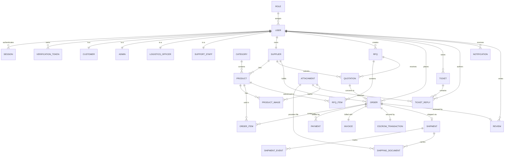
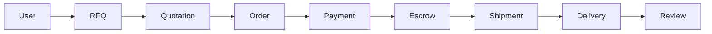

# Africhina Connect — Entity Relationship Design (ERD)

**Version:** 1.0
**Status:** Draft (Sprint 0.5 — UX & System Validation)
**Author:** Lead Database Architect / Senior Backend Engineer
**Audience:** Backend Developers, DBAs, Software Architects

---

## 1. Purpose & Scope

This document describes how every entity in the Africhina Connect system relates to one another, and **why** those relationships exist. It is a _design_ document that complements (and refines) the physical schema in `docs/database-schema.md` — it explains the reasoning behind foreign keys, cardinality, cascade behavior, and integrity rules rather than merely listing columns.

It uses **Mermaid ER diagrams** for visual representation and is written for backend developers, DBAs, and software architects.

---

## 2. Entity Reference

For each entity the following are documented: **Purpose, Primary Key, Foreign Keys, 1:1 / 1:N / M:N relationships, Cascade rules, Soft delete strategy, and Index recommendations.**

### 2.1 Authentication

#### User

- **Purpose:** Core identity record for every person on the platform (single source of truth for credentials & profile).
- **Primary Key:** `id (cuid)`
- **Foreign Keys:** `roleId → Role.id`
- **1:1:** `Session` (for a given active login), `UserProfile`
- **1:N:** Orders (as buyer), Tickets, Notifications, Reviews, Attachments
- **M:N:** none directly (roles via FK)
- **Cascade:** On delete → restrict (historical orders must not be lost).
- **Soft delete:** Yes — `deletedAt` timestamp; preserve audit & order history.
- **Indexes:** `email` (unique), `roleId`, `status`.

#### Role

- **Purpose:** Defines a permission set (buyer, admin, logistics, support, supplier, agent).
- **Primary Key:** `id (cuid)`
- **Foreign Keys:** none
- **1:N:** `User`
- **Cascade:** On delete → restrict (users depend on role).
- **Soft delete:** No (system constants).
- **Indexes:** `code` (unique).

#### Session

- **Purpose:** Tracks an authenticated login (managed by Better Auth).
- **Primary Key:** `id (cuid)`
- **Foreign Keys:** `userId → User.id`
- **1:1:** `User` (current active session relationship)
- **1:N:** (a user can have many sessions, but one is "current")
- **Cascade:** On delete user → cascade (remove sessions).
- **Soft delete:** No (sessions are ephemeral; expired at `expiresAt`).
- **Indexes:** `token`/`sessionToken` (unique), `userId`, `expiresAt`.

#### Verification Token

- **Purpose:** Holds email-verification / password-reset tokens.
- **Primary Key:** `id (cuid)`
- **Foreign Keys:** `userId → User.id`
- **1:N:** `User` (a user can have multiple issued tokens).
- **Cascade:** On delete user → cascade.
- **Soft delete:** No (short-lived; purged by TTL).
- **Indexes:** `token` (unique), `userId`, `expiresAt`, `type`.

---

### 2.2 Business Roles

The business roles (**Customer, Admin, Logistics Officer, Support Staff**) are **not separate tables** — they are specializations of `User` distinguished by `Role`. This is a deliberate design choice:

- **Why:** Reduces duplication, centralizes auth, and keeps permission logic in one `Role` entity. Each role is a `User` with a specific `Role` and optional role-specific profile data.

#### Customer (Buyer)

- **Purpose:** A User with `role = buyer`; holds buyer-specific data (default address, preferences).
- **Primary Key:** `id (cuid)` (same as `User.id`)
- **Foreign Keys:** `id → User.id` (is-a relationship)
- **1:N:** Orders, RFQs, Reviews, Tickets.
- **Cascade:** On user delete → restrict (preserve history).
- **Soft delete:** Yes (via User).
- **Indexes:** `userId` (as PK/FK), `status`.

#### Admin

- **Purpose:** A User with `role = admin`; platform operators.
- **Primary Key:** `id (cuid)`
- **Foreign Keys:** `id → User.id`
- **1:N:** Orders they mediate, Escrow releases, moderation actions.
- **Cascade:** On user delete → restrict.
- **Soft delete:** Yes (via User).
- **Indexes:** `userId` (PK/FK).

#### Logistics Officer

- **Purpose:** A User with `role = logistics`; manages shipments.
- **Primary Key:** `id (cuid)`
- **Foreign Keys:** `id → User.id`
- **1:N:** Shipments assigned, Shipment Events they create.
- **Cascade:** On user delete → restrict.
- **Soft delete:** Yes (via User).
- **Indexes:** `userId` (PK/FK).

#### Support Staff

- **Purpose:** A User with `role = support`; handles tickets.
- **Primary Key:** `id (cuid)`
- **Foreign Keys:** `id → User.id`
- **1:N:** Tickets assigned, Ticket Replies.
- **Cascade:** On user delete → restrict.
- **Soft delete:** Yes (via User).
- **Indexes:** `userId` (PK/FK).

---

### 2.3 Catalogue

#### Category

- **Purpose:** Hierarchical grouping of products for navigation & filtering.
- **Primary Key:** `id (cuid)`
- **Foreign Keys:** `parentId → Category.id` (self-referencing, nullable).
- **1:N:** Product, and self-referencing `Category` (sub-categories).
- **Cascade:** On delete → restrict if products exist; on parent delete → set `parentId` null (or restrict).
- **Soft delete:** Yes — preserve product history.
- **Indexes:** `slug` (unique), `parentId`, `name`.

#### Supplier

- **Purpose:** Business identity of a verified seller; references the owning User.
- **Primary Key:** `id (cuid)`
- **Foreign Keys:** `userId → User.id`.
- **1:1:** `User` (owner).
- **1:N:** Product, Quotation, Shipping Document (source).
- **Cascade:** On user delete → restrict.
- **Soft delete:** Yes — `deletedAt`; retain order references.
- **Indexes:** `userId` (unique), `verificationStatus`, `rating`.

#### Product

- **Purpose:** A sellable item listed by a supplier under a category.
- **Primary Key:** `id (cuid)`
- **Foreign Keys:** `supplierId → Supplier.id`, `categoryId → Category.id`.
- **1:N:** Product Image, Order Item, RFQ Item.
- **Cascade:** On supplier delete → restrict; on category delete → restrict.
- **Soft delete:** Yes — products are deactivated rather than hard-deleted to preserve order history.
- **Indexes:** `supplierId`, `categoryId`, `status`, `price`, full-text `title`/`description`.

#### Product Image

- **Purpose:** Stores media (Cloudinary) for a product.
- **Primary Key:** `id (cuid)`
- **Foreign Keys:** `productId → Product.id`.
- **1:N:** `Product` (many images per product).
- **Cascade:** On product delete → cascade (images are owned solely by the product).
- **Soft delete:** No.
- **Indexes:** `productId`, `sortOrder`.

---

### 2.4 RFQ System

#### RFQ

- **Purpose:** A buyer's request-for-quotation header.
- **Primary Key:** `id (cuid)`
- **Foreign Keys:** `buyerId → User.id` (or Customer).
- **1:N:** RFQ Item, Quotation.
- **Cascade:** On buyer delete → restrict (keep business records).
- **Soft delete:** Yes — keep audit trail.
- **Indexes:** `buyerId`, `status`, `createdAt`.

#### RFQ Item

- **Purpose:** Line items within an RFQ (product, quantity, specs).
- **Primary Key:** `id (cuid)`
- **Foreign Keys:** `rfqId → RFQ.id`, `productId → Product.id` (nullable — buyer may describe a custom need).
- **M:N:** effectively links `RFQ` and `Product` via the item.
- **Cascade:** On RFQ delete → cascade; on product delete → set null.
- **Soft delete:** No.
- **Indexes:** `rfqId`, `productId`.

#### Quotation

- **Purpose:** A supplier's price & delivery offer for an RFQ.
- **Primary Key:** `id (cuid)`
- **Foreign Keys:** `rfqId → RFQ.id`, `supplierId → Supplier.id`.
- **1:N:** `RFQ` (many quotations per RFQ), `Supplier` (many quotations).
- **Cascade:** On RFQ delete → cascade; on supplier delete → restrict.
- **Soft delete:** No (only cancel/expire via status).
- **Indexes:** `rfqId`, `supplierId`, `status`, `createdAt`.

---

### 2.5 Ordering

#### Order

- **Purpose:** Central record of a purchase transaction.
- **Primary Key:** `id (cuid)`
- **Foreign Keys:** `buyerId → User.id`, `supplierId → Supplier.id`, `quotationId → Quotation.id` (nullable).
- **1:1:** `Escrow Transaction`, `Invoice`.
- **1:N:** Order Item, Payment, Shipment, Ticket, Review.
- **Cascade:** On buyer/supplier delete → restrict.
- **Soft delete:** No (legal/financial record; use status lifecycle).
- **Indexes:** `buyerId`, `supplierId`, `status`, `orderNumber` (unique), `createdAt`.

#### Order Item

- **Purpose:** Line items within an order (snapshot of product + price).
- **Primary Key:** `id (cuid)`
- **Foreign Keys:** `orderId → Order.id`, `productId → Product.id`.
- **1:N:** `Order` (many items), `Product`.
- **Cascade:** On order delete → cascade; on product delete → set null (snapshot retained).
- **Soft delete:** No.
- **Indexes:** `orderId`, `productId`.

---

### 2.6 Payments

#### Payment

- **Purpose:** A payment attempt/transaction record against an order.
- **Primary Key:** `id (cuid)`
- **Foreign Keys:** `orderId → Order.id`, `providerRef` (externally unique).
- **1:N:** `Order` (an order can have multiple payment attempts).
- **Cascade:** On order delete → restrict.
- **Soft delete:** No (financial audit).
- **Indexes:** `providerRef` (unique), `orderId`, `status`, `createdAt`.

#### Invoice

- **Purpose:** A billing document for an order (1:1 with Order).
- **Primary Key:** `id (cuid)`
- **Foreign Keys:** `orderId → Order.id` (unique), `paymentId → Payment.id` (nullable).
- **1:1:** `Order`.
- **Cascade:** On order delete → restrict.
- **Soft delete:** No.
- **Indexes:** `orderId` (unique), `invoiceNumber` (unique).

#### Escrow Transaction

- **Purpose:** Holds funds for an order until milestone release.
- **Primary Key:** `id (cuid)`
- **Foreign Keys:** `orderId → Order.id` (unique).
- **1:1:** `Order`.
- **1:N:** `Escrow Release` (optional history of releases).
- **Cascade:** On order delete → restrict.
- **Soft delete:** No.
- **Indexes:** `orderId` (unique), `status`.

---

### 2.7 Shipping

#### Shipment

- **Purpose:** Represents the physical delivery of an order.
- **Primary Key:** `id (cuid)`
- **Foreign Keys:** `orderId → Order.id`, `assigneeId → User.id` (logistics officer, nullable).
- **1:1:** `Order` (one shipment per physical order by default).
- **1:N:** Shipment Event, Shipping Document.
- **Cascade:** On order delete → restrict; on assignee delete → set null.
- **Soft delete:** No.
- **Indexes:** `orderId` (unique), `assigneeId`, `status`, `trackingNumber` (unique).

#### Shipment Event

- **Purpose:** Ordered timeline of status changes/locations for a shipment.
- **Primary Key:** `id (cuid)`
- **Foreign Keys:** `shipmentId → Shipment.id`, `createdById → User.id`.
- **1:N:** `Shipment`.
- **Cascade:** On shipment delete → cascade.
- **Soft delete:** No (immutable log).
- **Indexes:** `shipmentId`, `occurredAt`.

#### Shipping Document

- **Purpose:** Files attached to a shipment (invoice, packing list, B/L, customs).
- **Primary Key:** `id (cuid)`
- **Foreign Keys:** `shipmentId → Shipment.id`, `attachmentId → Attachment.id`.
- **1:N:** `Shipment`.
- **Cascade:** On shipment delete → cascade (or set attachment to null).
- **Soft delete:** No.
- **Indexes:** `shipmentId`, `type`.

---

### 2.8 Support

#### Ticket

- **Purpose:** A support request raised by a user against a context (order, payment, shipment).
- **Primary Key:** `id (cuid)`
- **Foreign Keys:** `customerId → User.id`, `assigneeId → User.id` (support staff), `orderId → Order.id` (nullable reference).
- **1:N:** `Ticket Reply`, `User` (customer & assignee).
- **Cascade:** On customer delete → restrict; on assignee delete → set null.
- **Soft delete:** No (archive via status).
- **Indexes:** `customerId`, `assigneeId`, `status`, `priority`, `createdAt`.

#### Ticket Reply

- **Purpose:** A message in a ticket conversation.
- **Primary Key:** `id (cuid)`
- **Foreign Keys:** `ticketId → Ticket.id`, `authorId → User.id`.
- **1:N:** `Ticket`.
- **Cascade:** On ticket delete → cascade.
- **Soft delete:** No.
- **Indexes:** `ticketId`, `createdAt`.

---

### 2.9 Notifications

#### Notification

- **Purpose:** In-app/email notification for a user.
- **Primary Key:** `id (cuid)`
- **Foreign Keys:** `userId → User.id`, `entityRef` (polymorphic: order/shipment/ticket id).
- **1:N:** `User` (many notifications).
- **Cascade:** On user delete → cascade.
- **Soft delete:** No.
- **Indexes:** `userId`, `read`, `createdAt`.

---

### 2.10 Reviews

#### Review

- **Purpose:** Buyer rating & feedback on a product/supplier after completion.
- **Primary Key:** `id (cuid)`
- **Foreign Keys:** `orderId → Order.id`, `buyerId → User.id`, `productId → Product.id` (nullable), `supplierId → Supplier.id` (nullable).
- **1:1:** `Order` (one review per completed order item/order).
- **Cascade:** On order delete → restrict; on buyer delete → restrict.
- **Soft delete:** Yes — admin can hide reviews.
- **Indexes:** `orderId` (unique), `buyerId`, `productId`, `supplierId`, `rating`.

---

### 2.11 Files

#### Attachment

- **Purpose:** A generic file reference (Cloudinary URL, metadata) reused across domains.
- **Primary Key:** `id (cuid)`
- **Foreign Keys:** `uploadedBy → User.id`. Polymorphic `ownerType`/`ownerId` optional.
- **M:N:** linked to products, shipments, tickets, reviews via owner references.
- **Cascade:** On uploader delete → set null.
- **Soft delete:** Yes — allow restore.
- **Indexes:** `uploadedBy`, `ownerType`, `ownerId`.

---

## 3. Mermaid ER Diagram

---

## 4. Relationship Explanations

The relationships exist to support the platform's core workflows and integrity requirements:

1. **User ↔ Session / Verification Token:** every authenticated action needs a valid session; email verification & password resets rely on scoped tokens. A user can have many sessions/tokens but one current active session.

2. **Role → User:** RBAC is enforced via a role lookup. Centralizing roles avoids duplicating permission logic across five business persona tables.

3. **User is-a Customer/Admin/Logistics/Support:** rather than separate user tables, the business roles are rows in `User` with a `roleId`. This keeps authentication unified and avoids join complexity. Role-specific attributes are stored on the specialization records (e.g., `Customer` extends `User`).

4. **Category → Product → Product Image:** products are organized into a hierarchy and own their media. Images cascade with the product because they have no independent lifecycle.

5. **Supplier → Product:** suppliers own their catalog; deleting a supplier is restricted to preserve order history, so products are soft-deleted/deactivated instead.

6. **RFQ → RFQ Item → Product:** an RFQ references products (or custom specs) via line items, enabling multiple products per request.

7. **RFQ → Quotation → Order:** a quotation belongs to exactly one RFQ and one supplier; accepting a quotation converts it into an Order, preserving the audit chain from request to purchase.

8. **Order → Order Item → Product:** orders snapshot line items at purchase time so historical prices remain accurate even if a product changes later.

9. **Order → Payment / Invoice / Escrow:** an order is settled by one or more payments, billed by a single invoice, and secured by a single escrow transaction. Escrow is 1:1 with the order to keep fund control unambiguous.

10. **Order → Shipment → Shipment Event / Shipping Document:** each order ships via one shipment; the shipment owns an immutable event log and carries supporting documents (backed by the generic Attachment).

11. **Ticket → Ticket Reply:** a support ticket is a conversation thread; replies cascade with the ticket.

12. **User → Notification:** notifications are per-user and cascade on user deletion.

13. **Order → Review:** a review is tied to a completed order to prove purchase; it may reference a product and/or supplier for reputation.

14. **Attachment (polymorphic):** a generic file record reused across products, shipping documents, replies, and reviews to avoid duplicating file metadata.

---

## 5. Cardinality Table

| #   | Relationship                       | Cardinality | Cascade           |
| --- | ---------------------------------- | ----------- | ----------------- |
| 1   | Role → User                        | 1:N         | Restrict          |
| 2   | User → Session                     | 1:N         | Cascade           |
| 3   | User → Verification Token          | 1:N         | Cascade           |
| 4   | User → Customer                    | 1:1         | Restrict          |
| 5   | User → Admin                       | 1:1         | Restrict          |
| 6   | User → Logistics Officer           | 1:1         | Restrict          |
| 7   | User → Support Staff               | 1:1         | Restrict          |
| 8   | User → Supplier                    | 1:1         | Restrict          |
| 9   | Category → Category (parent)       | 1:N self    | Restrict/Set null |
| 10  | Category → Product                 | 1:N         | Restrict          |
| 11  | Supplier → Product                 | 1:N         | Restrict          |
| 12  | Product → Product Image            | 1:N         | Cascade           |
| 13  | Product → Order Item               | 1:N         | Set null          |
| 14  | Product → RFQ Item                 | 1:N         | Set null          |
| 15  | User → RFQ                         | 1:N         | Restrict          |
| 16  | RFQ → RFQ Item                     | 1:N         | Cascade           |
| 17  | RFQ → Quotation                    | 1:N         | Cascade           |
| 18  | Supplier → Quotation               | 1:N         | Restrict          |
| 19  | Quotation → Order                  | 1:1         | Restrict          |
| 20  | User → Order                       | 1:N         | Restrict          |
| 21  | Supplier → Order                   | 1:N         | Restrict          |
| 22  | Order → Order Item                 | 1:N         | Cascade           |
| 23  | Order → Payment                    | 1:N         | Restrict          |
| 24  | Order → Invoice                    | 1:1         | Restrict          |
| 25  | Order → Escrow Transaction         | 1:1         | Restrict          |
| 26  | Order → Shipment                   | 1:1         | Restrict          |
| 27  | Shipment → Shipment Event          | 1:N         | Cascade           |
| 28  | Shipment → Shipping Document       | 1:N         | Cascade           |
| 29  | Attachment → Shipping Document     | 1:N         | Set null          |
| 30  | User → Ticket                      | 1:N         | Restrict          |
| 31  | Ticket → Ticket Reply              | 1:N         | Cascade           |
| 32  | User → Ticket Reply                | 1:N         | Restrict          |
| 33  | User → Notification                | 1:N         | Cascade           |
| 34  | Order → Review                     | 1:1         | Restrict          |
| 35  | User → Review                      | 1:N         | Restrict          |
| 36  | Attachment → Product Image / Reply | 1:N         | Set null          |

---

## 6. Lifecycle of an Order

1. **User** registers/logs in (role `buyer`).
2. **RFQ** is created by the buyer with line items (RFQ Item).
3. **Quotation** is submitted by a supplier for the RFQ.
4. Buyer accepts the quotation → **Order** is created (with order items).
5. **Payment** is initiated via Paystack/Flutterwave; funds move to **Escrow**.
6. Supplier produces & ships; **Shipment** created with events.
7. Shipment delivered; buyer confirms — **Escrow** released.
8. Order completed; buyer leaves a **Review**.

---

## 7. Data Integrity Rules

1. **Referential integrity:** all FKs enforced; no orphaned orders, payments, or tickets.
2. **Escrow 1:1:** an order can have exactly one active escrow transaction.
3. **Unique transient keys:** `email`, `orderNumber`, `invoiceNumber`, `providerRef`, `trackingNumber`, `sessionToken`, `verificationToken` must be unique.
4. **Amounts:** money stored as integer cents/Decimal; currency code enforced per record.
5. **Status transitions:** order/shipment/escrow statuses advance only via valid transitions (state machine).
6. **Idempotent payments:** `providerRef` unique prevents double-processing from webhooks.
7. **No hard deletes on financial entities:** orders, payments, escrows, invoices are immutable (soft-delete or status-based).
8. **Check constraints:** positive quantities & amounts; valid enum values.
9. **Audit trail:** shipment events and ticket replies are append-only.

---

## 8. Performance Recommendations

1. **Indexes:** index all FKs and hot filter columns (`status`, `createdAt`, `buyerId`, `supplierId`).
2. **Composite indexes:** `(orderId, status)`, `(userId, read)` on notifications, `(rfqId, status)` on quotations.
3. **Partial indexes:** on active rows only (e.g., escrow `status = 'held'`) to keep indexes small.
4. **Full-text search:** GIN index on product `title`/`description` for catalogue search.
5. **Connection pooling:** use PgBouncer / Neon pooling with Prisma.
6. **Pagination:** keyset (cursor) pagination for large lists (orders, payments, notifications) instead of OFFSET.
7. **Read models:** materialized views for dashboard KPIs and reports to avoid heavy aggregation on hot tables.
8. **Query limiting:** restrict list endpoints to required columns; avoid `SELECT *`.
9. **N+1 avoidance:** use Prisma `include`/`select` carefully and batch related queries.

---

## 9. Future Database Scalability Recommendations

1. **Partitioning:** partition `shipment_events`, `notifications`, and `payments` by time (e.g., monthly) as volume grows.
2. **Read replicas:** direct analytics/reporting reads to a replica.
3. **Event sourcing / audit table:** move immutable event logs (shipment events) to an append-only store.
4. **Cache layer:** Redis for hot catalogue, session, and KPI counters.
5. **Search engine:** move catalogue search to a dedicated engine (e.g., Meilisearch/OpenSearch) beyond Postgres full-text.
6. **Sharding (very long-term):** shard by tenant/region only if a single Postgres becomes the bottleneck.
7. **Queue-backed writes:** decouple webhook processing and notification fan-out via a job queue.

---

## 10. Review of Existing Schema & Recommended Improvements

The existing schema (`docs/database-schema.md`) is solid. Recommended improvements:

1. **Introduce a `Role` table** for clean RBAC instead of a single `role` enum column, enabling future permission management without migrations.
2. **Add `Role`-specialization records** (`Customer`, `Admin`, `LogisticsOfficer`, `SupportStaff`) as 1:1 extensions of `User`. This makes the business-role split explicit and extensible.
3. **Add `Invoice` entity** (currently missing) modeled 1:1 with `Order` for billing documents.
4. **Rename escrow to `Escrow Transaction`** and allow a release history table for auditability of milestone releases.
5. **Add `Attachment` (Files)** as a generic polymorphic file record to unify media/metadata across products, shipping documents, tickets, and reviews.
6. **Add `Ticket` and `Ticket Reply`** explicitly (Sprint 0.5 added Support Staff role; schema should reflect support workflows).
7. **Add `RFQ Item`** to support multiple products/specs per RFQ (currently only a single product assumption).
8. **Add `Review`** entity for post-completion ratings (currently absent despite being in the product plan).
9. **Add `Verification Token`** table for email verification & password reset (Better Auth compatibility).
10. **Add `Session` table** for explicit session management (Better Auth).
11. **Enforce soft-delete strategy** on domain entities (User, Supplier, Product, Review) while keeping financial/logistic entities immutable.
12. **Enforce cascade rules** as documented in Section 5 (e.g., cascade for owned children, restrict for financial references).

---

_End of Entity Relationship Design — Sprint 0.5._
</content>
