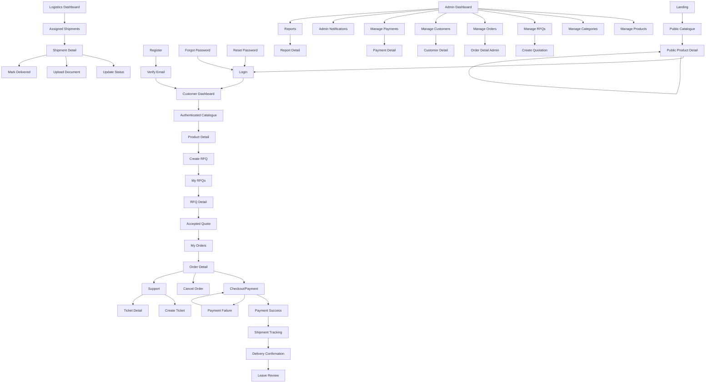

# Africhina Connect — Screen Inventory

**Version:** 1.0
**Status:** Draft (Sprint 0.5 — UX & System Validation)
**Author:** Lead Product Designer / Senior UX Architect
**Audience:** Developers, Designers, Testers, Stakeholders

---

## 1. Purpose & Scope

This document defines every screen that will exist in the Africhina Connect application before any UI is built. It serves as the single source of truth for screen-level requirements, routes, components, actions, data, and API dependencies.

Each screen maps back to the **User Flow document** (`docs/user-flow.md`). Screens are organized into **16 logical modules** and numbered `SCR-001` onward.

---

## 2. Reusable Layouts

The following layouts are reused across screens to ensure consistency and maintainability:

| Layout ID | Layout Name             | Used By                             |
| --------- | ----------------------- | ----------------------------------- |
| LAY-01    | Public Layout           | Public & Authentication modules     |
| LAY-02    | Guest Layout            | Landing, catalog browsing (no auth) |
| LAY-03    | Authenticated App Shell | Customer & Supplier dashboards      |
| LAY-04    | Admin Shell             | Admin Dashboard, Reports, Settings  |
| LAY-05    | Logistics Shell         | Logistics Dashboard                 |
| LAY-06    | Support Shell           | Support Module                      |
| LAY-07    | Error Layout            | Error Pages                         |

---

## 3. Reusable UI Components

Suggested reusable components (built on shadcn/ui) to be used across screens:

| Component          | Used In                                       |
| ------------------ | --------------------------------------------- |
| `AppHeader`        | All authenticated shells                      |
| `SideNav`          | Admin, Logistics, Support shells              |
| `DataTable`        | Lists (orders, products, customers, tickets)  |
| `Pagination`       | All list screens                              |
| `SearchBar`        | Catalogue, Admin, Support                     |
| `FilterBar`        | Lists & catalogue                             |
| `Breadcrumbs`      | Detail pages                                  |
| `StatusBadge`      | Order/shipment/payment/ticket status          |
| `EmptyState`       | Empty lists & search no-results               |
| `CurrencyInput`    | Payment, RFQ, quotation forms                 |
| `ImageUploader`    | Product & document uploads                    |
| `Toast`            | Global success/error feedback                 |
| `ConfirmDialog`    | Destructive actions (delete, cancel, release) |
| `FormField`        | Standardized form inputs with validation      |
| `Tabs`             | Detail pages with multiple sections           |
| `Timeline`         | Shipment tracking & order history             |
| `NotificationBell` | All authenticated shells                      |
| `FilterCarousel`   | Catalogue category browsing                   |

---

## MODULE A — Public

### SCR-001 — Landing / Home

- **Purpose:** Introduce the platform and drive users to browse or register.
- **Role:** Guest
- **Route:** `/`
- **Main Components:** Hero, ValueProps, HowItWorks, Testimonials, CategoryShowcase, CTA
- **Primary Action:** Browse Products
- **Secondary Actions:** Register, Login, Contact Support
- **API:** `GET /api/categories`, `GET /api/products?featured=true`
- **Entry:** Direct URL
- **Exit:** Navigate to catalogue, auth, or support
- **Validation:** None

### SCR-002 — Public Product Catalogue

- **Purpose:** Browse products without login.
- **Role:** Guest
- **Route:** `/products`
- **Main Components:** ProductGrid, FilterBar, SearchBar, Pagination, CategoryFilter
- **Primary Action:** View Product
- **Secondary Actions:** Search, Filter, Sort, Request Quote (prompts login)
- **API:** `GET /api/products`
- **Entry:** Landing, header nav
- **Exit:** Product detail, auth
- **Validation:** None

### SCR-003 — Product Detail (Public)

- **Purpose:** View full product information.
- **Role:** Guest
- **Route:** `/products/[id]`
- **Main Components:** ImageGallery, ProductInfo, SupplierCard, PriceBlock, RFQ CTA
- **Primary Action:** Request Quote
- **Secondary Actions:** Contact Supplier, Back to Catalogue
- **API:** `GET /api/products/:id`
- **Entry:** Product grid
- **Exit:** RFQ (or login), catalogue
- **Validation:** None

### SCR-004 — About / How It Works

- **Purpose:** Explain the import process.
- **Role:** Guest
- **Route:** `/about`
- **Main Components:** StepsTimeline, FAQ, TrustSignals
- **Primary Action:** Start Sourcing
- **Secondary Actions:** Browse Products, Contact
- **API:** None
- **Entry:** Footer/header
- **Exit:** Auth, catalogue

### SCR-005 — Contact Support (Public)

- **Purpose:** Allow guests to submit a support request.
- **Role:** Guest
- **Route:** `/contact`
- **Main Components:** ContactForm, CategorySelect, MessageTextarea
- **Primary Action:** Submit Request
- **Secondary Actions:** Email/Chat links
- **API:** `POST /api/support/tickets`
- **Entry:** Header/footer
- **Exit:** Success confirmation, back home
- **Validation:** Valid email, required message, min length

---

## MODULE B — Authentication

### SCR-006 — Login

- **Purpose:** Allow users to securely access their accounts.
- **Role:** Guest
- **Route:** `/login`
- **Main Components:** EmailInput, PasswordInput, RememberMe, LoginButton, ForgotPasswordLink, OAuthButton
- **Primary Action:** Login
- **Secondary Action:** Forgot Password, Register
- **API:** `POST /api/auth/login`
- **Entry:** Header, protected route redirect
- **Exit:** Role dashboard (success), error message (failure)
- **Validation:** Valid email, required password, min length

### SCR-007 — Register

- **Purpose:** Create a new account.
- **Role:** Guest
- **Route:** `/register`
- **Main Components:** NameInput, EmailInput, PasswordInput, ConfirmPassword, RoleSelect, RegisterButton
- **Primary Action:** Create Account
- **Secondary Action:** Login, OAuth
- **API:** `POST /api/auth/register`
- **Entry:** Landing, login link
- **Exit:** Email verification, dashboard (success), errors (failure)
- **Validation:** Valid email, password strength, match confirm, role required

### SCR-008 — Forgot Password

- **Purpose:** Send a password reset link.
- **Role:** Guest
- **Route:** `/forgot-password`
- **Main Components:** EmailInput, SubmitButton, SuccessMessage
- **Primary Action:** Send Reset Link
- **Secondary Action:** Back to Login
- **API:** `POST /api/auth/forgot-password`
- **Entry:** Login link
- **Exit:** Success message, login
- **Validation:** Valid email

### SCR-009 — Reset Password

- **Purpose:** Set a new password via token.
- **Role:** Guest
- **Route:** `/reset-password`
- **Main Components:** NewPasswordInput, ConfirmPassword, SubmitButton, Token
- **Primary Action:** Reset Password
- **Secondary Action:** Login
- **API:** `POST /api/auth/reset-password`
- **Entry:** Email link
- **Exit:** Login (success), errors (failure)
- **Validation:** Password strength, match confirm

### SCR-010 — Verify Email

- **Purpose:** Confirm email ownership.
- **Role:** Guest
- **Route:** `/verify-email`
- **Main Components:** VerificationStatus, ResendButton
- **Primary Action:** Confirm Email
- **Secondary Action:** Resend Link
- **API:** `POST /api/auth/verify-email`
- **Entry:** Registration email link
- **Exit:** Login / dashboard
- **Validation:** Valid token

---

## MODULE C — Customer Dashboard

### SCR-011 — Customer Dashboard

- **Purpose:** Overview of the buyer's activity.
- **Role:** Customer
- **Route:** `/dashboard`
- **Main Components:** WelcomeHeader, KPIStatCards, RecentOrders, PendingRFQs, QuickActions
- **Primary Action:** View Recent Orders
- **Secondary Actions:** New RFQ, Track Shipment, Browse Products
- **API:** `GET /api/dashboard`, `GET /api/orders`, `GET /api/rfqs`
- **Entry:** Login redirect
- **Exit:** Any module
- **Validation:** None

---

## MODULE D — Product Catalogue

### SCR-012 — Product Catalogue (Authenticated)

- **Purpose:** Browse/search products while logged in.
- **Role:** Customer
- **Route:** `/catalogue`
- **Main Components:** ProductGrid, SearchBar, FilterBar, SortDropdown, Pagination, CategoryFilter
- **Primary Action:** View Product
- **Secondary Actions:** Search, Filter, Sort, Request Quote
- **API:** `GET /api/products`
- **Entry:** Dashboard, nav
- **Exit:** Product detail, RFQ
- **Validation:** None

### SCR-013 — Product Detail (Authenticated)

- **Purpose:** View product and request a quote.
- **Role:** Customer
- **Route:** `/catalogue/[id]`
- **Main Components:** ImageGallery, ProductInfo, SupplierCard, PriceBlock, RFQFormLink
- **Primary Action:** Request Quote
- **Secondary Actions:** Contact Supplier, Save to Watchlist
- **API:** `GET /api/products/:id`
- **Entry:** Catalogue grid
- **Exit:** RFQ, dashboard
- **Validation:** None

---

## MODULE E — RFQ (Request for Quote)

### SCR-014 — Create RFQ

- **Purpose:** Submit a request for quotation.
- **Role:** Customer
- **Route:** `/rfq/new`
- **Main Components:** RFQForm, ProductLookup, QuantityInput, DestinationInput, RequirementsTextarea, ImageUploader
- **Primary Action:** Submit RFQ
- **Secondary Actions:** Save Draft, Cancel
- **API:** `POST /api/rfqs`
- **Entry:** Product detail, dashboard
- **Exit:** RFQ detail (success), errors (failure)
- **Validation:** Required product, positive quantity, required destination

### SCR-015 — My RFQs

- **Purpose:** List the customer's RFQs.
- **Role:** Customer
- **Route:** `/rfq`
- **Main Components:** DataTable, StatusBadge, FilterBar, Pagination, NewRFQButton
- **Primary Action:** Open RFQ
- **Secondary Actions:** Create New, Filter
- **API:** `GET /api/rfqs`
- **Entry:** Dashboard, nav
- **Exit:** RFQ detail, create RFQ

### SCR-016 — RFQ Detail / Quotations

- **Purpose:** View RFQ and received quotations.
- **Role:** Customer
- **Route:** `/rfq/[id]`
- **Main Components:** RFQSummary, QuotationList, CompareQuotes, AcceptButton, RejectButton
- **Primary Action:** Accept Quote
- **Secondary Actions:** Reject Quote, View Supplier
- **API:** `GET /api/rfqs/:id`, `POST /api/quotations/:id/accept`
- **Entry:** My RFQs
- **Exit:** Order creation (accept), list (reject)
- **Validation:** Quote must be active (not expired)

### SCR-017 — Accepted Quote → Order

- **Purpose:** Convert an accepted quote into an order.
- **Role:** Customer
- **Route:** `/rfq/[id]/order`
- **Main Components:** OrderSummary, ShippingAddressForm, TermsCheckbox, ConfirmButton
- **Primary Action:** Place Order
- **Secondary Actions:** Cancel
- **API:** `POST /api/orders`
- **Entry:** Accepted quote
- **Exit:** Order detail (success), errors (failure)
- **Validation:** Required shipping address, accept terms

---

## MODULE F — Orders

### SCR-018 — My Orders

- **Purpose:** List the customer's orders.
- **Role:** Customer
- **Route:** `/orders`
- **Main Components:** DataTable, StatusBadge, FilterBar, Pagination, OrderNumberLink
- **Primary Action:** Open Order
- **Secondary Actions:** Filter, Track Shipment
- **API:** `GET /api/orders`
- **Entry:** Dashboard, nav
- **Exit:** Order detail

### SCR-019 — Order Detail

- **Purpose:** View order details & status.
- **Role:** Customer
- **Route:** `/orders/[id]`
- **Main Components:** OrderSummary, OrderItems, StatusTimeline, PaymentStatus, ActionButtons, Tabs
- **Primary Action:** Make Payment
- **Secondary Actions:** Track Shipment, Cancel Order, Contact Support, Download Invoice
- **API:** `GET /api/orders/:id`
- **Entry:** My Orders, RFQ order
- **Exit:** Payment, tracking, support
- **Validation:** Cancel only if allowed status

### SCR-020 — Cancel Order

- **Purpose:** Cancel an eligible order.
- **Role:** Customer
- **Route:** `/orders/[id]/cancel`
- **Main Components:** ConfirmDialog, CancelReasonForm
- **Primary Action:** Confirm Cancel
- **Secondary Action:** Keep Order
- **API:** `POST /api/orders/:id/cancel`
- **Entry:** Order detail
- **Exit:** Order detail (cancelled)
- **Validation:** Status allows cancellation

---

## MODULE G — Payments

### SCR-021 — Checkout / Payment

- **Purpose:** Pay for an order.
- **Role:** Customer
- **Route:** `/orders/[id]/payment`
- **Main Components:** OrderSummary, PaymentMethodSelect, ProviderRedirect, PayButton
- **Primary Action:** Pay Now
- **Secondary Actions:** Change Payment Method
- **API:** `POST /api/payments/initialize`
- **Entry:** Order detail
- **Exit:** Provider redirect, order detail (success/failure)
- **Validation:** Select provider, valid amount

### SCR-022 — Payment Success

- **Purpose:** Confirm payment success / escrow held.
- **Role:** Customer
- **Route:** `/orders/[id]/payment/success`
- **Main Components:** SuccessIcon, TransactionReference, EscrowStatus, NextSteps
- **Primary Action:** View Order
- **Secondary Actions:** Track Shipment
- **API:** `GET /api/payments/:ref/verify`
- **Entry:** Provider return
- **Exit:** Order detail, dashboard

### SCR-023 — Payment Failure

- **Purpose:** Communicate payment failure & retry.
- **Role:** Customer
- **Route:** `/orders/[id]/payment/failed`
- **Main Components:** ErrorIcon, ErrorMessage, RetryButton, ChangeMethodLink
- **Primary Action:** Retry Payment
- **Secondary Actions:** Change Method, Contact Support
- **API:** `GET /api/payments/:ref/verify`
- **Entry:** Provider return
- **Exit:** Payment retry, support

---

## MODULE H — Shipment Tracking

### SCR-024 — Shipment Tracking

- **Purpose:** Track shipment progress.
- **Role:** Customer
- **Route:** `/orders/[id]/shipment`
- **Main Components:** StatusTimeline, MapView, ShipmentEvents, CarrierInfo, DocumentsList
- **Primary Action:** Refresh Status
- **Secondary Actions:** Download Documents, Confirm Delivery, Contact Support
- **API:** `GET /api/orders/:id/shipment`
- **Entry:** Order detail, dashboard
- **Exit:** Delivery confirmation, support

### SCR-025 — Delivery Confirmation

- **Purpose:** Confirm package delivery.
- **Role:** Customer
- **Route:** `/orders/[id]/delivery-confirm`
- **Main Components:** ConfirmDialog, DeliveryPhotoUpload, IssueReportLink
- **Primary Action:** Confirm Delivery
- **Secondary Actions:** Report Issue
- **API:** `POST /api/orders/:id/delivery-confirm`
- **Entry:** Shipment tracking
- **Exit:** Order completed, dispute
- **Validation:** Required confirmation

### SCR-026 — Leave Review

- **Purpose:** Rate product/supplier after completion.
- **Role:** Customer
- **Route:** `/orders/[id]/review`
- **Main Components:** RatingInput, ReviewTextarea, SubmitButton
- **Primary Action:** Submit Review
- **Secondary Actions:** Skip
- **API:** `POST /api/reviews`
- **Entry:** Order completed
- **Exit:** Order detail (published)
- **Validation:** Rating required, text min length

---

## MODULE I — Notifications

### SCR-027 — Notifications

- **Purpose:** View in-app notifications.
- **Role:** Customer
- **Route:** `/notifications`
- **Main Components:** NotificationFeed, FilterTabs, MarkAllReadButton, NotificationItem
- **Primary Action:** Open Notification
- **Secondary Actions:** Mark Read, Mark All Read, Filter
- **API:** `GET /api/notifications`, `PUT /api/notifications/:id/read`
- **Entry:** NotificationBell
- **Exit:** Related item, dashboard

---

## MODULE J — Customer Profile

### SCR-028 — Customer Profile

- **Purpose:** Manage account details.
- **Role:** Customer
- **Route:** `/profile`
- **Main Components:** ProfileForm, AvatarUpload, ContactInfo, SaveButton
- **Primary Action:** Save Profile
- **Secondary Actions:** Change Password, Manage Addresses
- **API:** `PUT /api/profile`
- **Entry:** Header avatar
- **Exit:** Dashboard, settings
- **Validation:** Valid email, name required

### SCR-029 — Address Book

- **Purpose:** Manage shipping addresses.
- **Role:** Customer
- **Route:** `/profile/addresses`
- **Main Components:** AddressList, AddressForm, AddButton, DefaultBadge
- **Primary Action:** Add/Edit Address
- **Secondary Actions:** Set Default, Delete
- **API:** `GET/POST/PUT/DELETE /api/addresses`
- **Entry:** Profile, checkout
- **Exit:** Profile, checkout
- **Validation:** Required fields (street, city, state)

---

## MODULE K — Support

### SCR-030 — My Support Tickets

- **Purpose:** View the customer's support tickets.
- **Role:** Customer
- **Route:** `/support`
- **Main Components:** TicketList, StatusBadge, NewTicketButton, FilterBar
- **Primary Action:** Open Ticket
- **Secondary Actions:** New Ticket, Filter
- **API:** `GET /api/support/tickets`
- **Entry:** Header, nav
- **Exit:** Ticket detail, new ticket

### SCR-031 — Create Support Ticket

- **Purpose:** Submit a support request.
- **Role:** Customer
- **Route:** `/support/new`
- **Main Components:** TicketForm, CategorySelect, PrioritySelect, DescriptionTextarea, AttachmentUpload
- **Primary Action:** Submit Ticket
- **Secondary Actions:** Cancel
- **API:** `POST /api/support/tickets`
- **Entry:** My tickets, contact
- **Exit:** Ticket detail (success)
- **Validation:** Required category, min description length

### SCR-032 — Ticket Detail

- **Purpose:** View and converse on a ticket.
- **Role:** Customer
- **Route:** `/support/[id]`
- **Main Components:** ConversationThread, ReplyBox, StatusBadge, AttachmentList
- **Primary Action:** Send Reply
- **Secondary Actions:** Close Ticket (if resolved), Upload Attachment
- **API:** `GET/POST /api/support/tickets/:id`
- **Entry:** My tickets
- **Exit:** Ticket list, close

---

## MODULE L — Admin Dashboard

### SCR-033 — Admin Login

- **Purpose:** Admin authentication.
- **Role:** Admin
- **Route:** `/admin/login`
- **Main Components:** EmailInput, PasswordInput, LoginButton
- **Primary Action:** Login
- **Secondary Action:** Forgot Password
- **API:** `POST /api/auth/login`
- **Entry:** Admin URL
- **Exit:** Admin dashboard
- **Validation:** Valid email, required password

### SCR-034 — Admin Dashboard

- **Purpose:** Platform overview & KPIs.
- **Role:** Admin
- **Route:** `/admin`
- **Main Components:** KPIStatCards, Charts, RecentOrders, PendingVerifications, Alerts
- **Primary Action:** Open Section
- **Secondary Actions:** Generate Report, View Notifications
- **API:** `GET /api/admin/analytics`
- **Entry:** Admin login
- **Exit:** Any admin section

### SCR-035 — Manage Products

- **Purpose:** CRUD & moderation of products.
- **Role:** Admin
- **Route:** `/admin/products`
- **Main Components:** DataTable, SearchBar, FilterBar, StatusBadge, ActionButtons
- **Primary Action:** Edit Product
- **Secondary Actions:** Activate/Deactivate, Delete, View
- **API:** `GET/POST/PUT/DELETE /api/admin/products`
- **Entry:** Admin dashboard
- **Exit:** Product form, detail

### SCR-036 — Product Form (Admin)

- **Purpose:** Create/edit a product.
- **Role:** Admin
- **Route:** `/admin/products/new` , `/admin/products/[id]/edit`
- **Main Components:** ProductForm, ImageUploader, CategorySelect, PriceInput, StatusSelect
- **Primary Action:** Save Product
- **Secondary Actions:** Cancel, Preview
- **API:** `POST/PUT /api/admin/products`
- **Entry:** Manage products
- **Exit:** Manage products
- **Validation:** Title, price, category required

### SCR-037 — Manage Categories

- **Purpose:** CRUD of product categories.
- **Role:** Admin
- **Route:** `/admin/categories`
- **Main Components:** CategoryTree, AddButton, EditButton, DeleteButton
- **Primary Action:** Add Category
- **Secondary Actions:** Edit, Delete
- **API:** `GET/POST/PUT/DELETE /api/admin/categories`
- **Entry:** Admin nav
- **Exit:** Category form
- **Validation:** Name required

### SCR-038 — Manage RFQs

- **Purpose:** View and respond to RFQs.
- **Role:** Admin
- **Route:** `/admin/rfqs`
- **Main Components:** DataTable, StatusBadge, FilterBar, OpenRFQButton
- **Primary Action:** Open RFQ
- **Secondary Actions:** Filter, Create Quote
- **API:** `GET /api/admin/rfqs`
- **Entry:** Admin nav
- **Exit:** RFQ detail

### SCR-039 — Create Quotation (Admin)

- **Purpose:** Create a quotation for an RFQ.
- **Role:** Admin
- **Route:** `/admin/rfqs/[id]/quotation`
- **Main Components:** QuotationForm, PriceInput, CurrencyInput, DeliveryEstimateInput, NotesTextarea
- **Primary Action:** Submit Quotation
- **Secondary Actions:** Save Draft, Cancel
- **API:** `POST /api/rfqs/:id/quotations`
- **Entry:** Manage RFQs
- **Exit:** RFQ detail
- **Validation:** Price required, positive delivery estimate

### SCR-040 — Manage Orders (Admin)

- **Purpose:** Oversee all orders.
- **Role:** Admin
- **Route:** `/admin/orders`
- **Main Components:** DataTable, StatusBadge, FilterBar, Pagination, SearchBar
- **Primary Action:** Open Order
- **Secondary Actions:** Update Status, Filter
- **API:** `GET /api/admin/orders`
- **Entry:** Admin nav
- **Exit:** Order detail

### SCR-041 — Order Detail (Admin)

- **Purpose:** Manage a single order.
- **Role:** Admin
- **Route:** `/admin/orders/[id]`
- **Main Components:** OrderSummary, StatusTimeline, PaymentInfo, EscrowBlock, DisputeTab, ActionButtons
- **Primary Action:** Update Status
- **Secondary Actions:** Process Refund, Mediate Dispute, Release Escrow
- **API:** `GET /api/admin/orders/:id`, `PUT /api/orders/:id/status`
- **Entry:** Manage orders
- **Exit:** Order list, payments

### SCR-042 — Manage Customers

- **Purpose:** View & manage customer accounts.
- **Role:** Admin
- **Route:** `/admin/customers`
- **Main Components:** DataTable, SearchBar, StatusBadge, FilterBar, ActionButtons
- **Primary Action:** Open Customer
- **Secondary Actions:** Suspend/Activate, Open Support Ticket
- **API:** `GET /api/admin/users`
- **Entry:** Admin nav
- **Exit:** Customer profile

### SCR-043 — Customer Detail (Admin)

- **Purpose:** View a customer's full context.
- **Role:** Admin
- **Route:** `/admin/customers/[id]`
- **Main Components:** ProfileSummary, OrdersTab, PaymentsTab, TicketsTab, ActionButtons
- **Primary Action:** View Orders
- **Secondary Actions:** Suspend/Activate, Contact
- **API:** `GET /api/admin/users/:id`
- **Entry:** Manage customers
- **Exit:** Customer list

### SCR-044 — Manage Payments (Admin)

- **Purpose:** Oversee all payments & escrow.
- **Role:** Admin
- **Route:** `/admin/payments`
- **Main Components:** DataTable, StatusBadge, PaymentProvider, FilterBar, Pagination
- **Primary Action:** Open Payment
- **Secondary Actions:** Process Refund, Filter
- **API:** `GET /api/admin/payments`
- **Entry:** Admin nav
- **Exit:** Payment detail

### SCR-045 — Payment Detail (Admin)

- **Purpose:** View a payment and process refunds.
- **Role:** Admin
- **Route:** `/admin/payments/[id]`
- **Main Components:** PaymentSummary, TransactionRef, ProviderInfo, RefundButton, StatusBadge
- **Primary Action:** Process Refund
- **Secondary Actions:** View Related Order
- **API:** `GET /api/admin/payments/:id`, `POST /api/escrows/:orderId/refund`
- **Entry:** Manage payments
- **Exit:** Payment list
- **Validation:** Refund confirmation

### SCR-046 — Admin Notifications

- **Purpose:** Compose & manage platform notifications.
- **Role:** Admin
- **Route:** `/admin/notifications`
- **Main Components:** NotificationFeed, ComposeForm, SegmentSelect, SendButton
- **Primary Action:** Send Announcement
- **Secondary Actions:** Mark Read, Filter
- **API:** `GET /api/admin/notifications`, `POST /api/notifications`
- **Entry:** Admin nav
- **Exit:** Admin dashboard

---

## MODULE M — Logistics Dashboard

### SCR-047 — Logistics Dashboard

- **Purpose:** Overview of assigned shipments.
- **Role:** Logistics
- **Route:** `/logistics`
- **Main Components:** KPIStatCards, AssignedShipments, PendingUpdates, DeliveredToday
- **Primary Action:** Open Shipment
- **Secondary Actions:** Filter, View Pending
- **API:** `GET /api/logistics/shipments`
- **Entry:** Logistics login
- **Exit:** Shipment detail

### SCR-048 — Assigned Shipments

- **Purpose:** List all assigned shipments.
- **Role:** Logistics
- **Route:** `/logistics/shipments`
- **Main Components:** DataTable, StatusBadge, FilterBar, SearchBar, Pagination
- **Primary Action:** Open Shipment
- **Secondary Actions:** Filter, Update Status
- **API:** `GET /api/logistics/shipments`
- **Entry:** Logistics dashboard
- **Exit:** Shipment detail

### SCR-049 — Shipment Detail (Logistics)

- **Purpose:** Manage a single shipment.
- **Role:** Logistics
- **Route:** `/logistics/shipments/[id]`
- **Main Components:** ShipmentSummary, StatusTimeline, EventsList, DocumentList, ActionButtons
- **Primary Action:** Update Status
- **Secondary Actions:** Upload Document, Mark Delivered
- **API:** `GET /api/logistics/shipments/:id`
- **Entry:** Assigned shipments
- **Exit:** Shipment list

### SCR-050 — Update Shipment Status

- **Purpose:** Advance shipment status.
- **Role:** Logistics
- **Route:** `/logistics/shipments/[id]/update`
- **Main Components:** StatusSelect, LocationInput, NotesInput, SubmitButton
- **Primary Action:** Submit Update
- **Secondary Actions:** Cancel
- **API:** `POST /api/shipments/:id/events`
- **Entry:** Shipment detail
- **Exit:** Shipment detail
- **Validation:** Valid status transition

### SCR-051 — Upload Shipping Document

- **Purpose:** Attach shipping documents.
- **Role:** Logistics
- **Route:** `/logistics/shipments/[id]/documents`
- **Main Components:** DocumentUploader, DocTypeSelect, UploadButton, DocumentList
- **Primary Action:** Upload
- **Secondary Actions:** Cancel, Delete
- **API:** `POST /api/shipments/:id/documents`
- **Entry:** Shipment detail
- **Exit:** Shipment detail
- **Validation:** Allowed file type/size

### SCR-052 — Mark Shipment Delivered

- **Purpose:** Confirm delivery to customer.
- **Role:** Logistics
- **Route:** `/logistics/shipments/[id]/deliver`
- **Main Components:** ConfirmDialog, PODUpload, DeliveryNotes, ConfirmButton
- **Primary Action:** Confirm Delivered
- **Secondary Actions:** Cancel
- **API:** `POST /api/shipments/:id/deliver`
- **Entry:** Shipment detail
- **Exit:** Shipment detail
- **Validation:** POD required

---

## MODULE N — Reports

### SCR-053 — Reports

- **Purpose:** Generate & view platform reports.
- **Role:** Admin
- **Route:** `/admin/reports`
- **Main Components:** ReportTypeSelect, DateRangePicker, ChartView, ExportButton
- **Primary Action:** Generate Report
- **Secondary Actions:** Export CSV/PDF, Filter by Type
- **API:** `GET /api/admin/reports`
- **Entry:** Admin nav
- **Exit:** Admin dashboard

### SCR-054 — Report Detail

- **Purpose:** View a specific report.
- **Role:** Admin
- **Route:** `/admin/reports/[id]`
- **Main Components:** ReportView, ChartView, DataTable, ExportButton, DateFilter
- **Primary Action:** Export
- **Secondary Actions:** Print, Filter
- **API:** `GET /api/admin/reports/:id`
- **Entry:** Reports
- **Exit:** Reports list

---

## MODULE O — Settings

### SCR-055 — Settings

- **Purpose:** Manage platform/account settings.
- **Role:** Admin (platform) / All (account)
- **Route:** `/settings`
- **Main Components:** Tabs, ProfileSettings, SecuritySettings, NotificationPreferences
- **Primary Action:** Save Settings
- **Secondary Actions:** Change Password, Update Preferences
- **API:** `PUT /api/settings`
- **Entry:** Header avatar
- **Exit:** Dashboard
- **Validation:** Valid fields per tab

### SCR-056 — Security Settings

- **Purpose:** Manage password & security.
- **Role:** All
- **Route:** `/settings/security`
- **Main Components:** CurrentPasswordInput, NewPasswordInput, ConfirmPassword, TwoFactorToggle
- **Primary Action:** Update Password
- **Secondary Actions:** Enable 2FA
- **API:** `PUT /api/settings/security`
- **Entry:** Settings
- **Exit:** Settings
- **Validation:** Current password, new password strength, match

---

## MODULE P — Error Pages

### SCR-057 — 404 Not Found

- **Purpose:** Inform user of an invalid route.
- **Role:** All
- **Route:** `*` (fallback)
- **Main Components:** ErrorIcon, Message, BackHomeButton, SearchLink
- **Primary Action:** Go Home
- **Secondary Action:** Browse Products
- **API:** None
- **Entry:** Invalid URL
- **Exit:** Home, catalogue

### SCR-058 — 403 Forbidden

- **Purpose:** Inform user of insufficient permissions.
- **Role:** All
- **Route:** `/403`
- **Main Components:** ErrorIcon, Message, BackButton, ContactSupportLink
- **Primary Action:** Go Back
- **Secondary Action:** Contact Support
- **API:** None
- **Entry:** Role-guarded route
- **Exit:** Dashboard, support

### SCR-059 — 500 Server Error

- **Purpose:** Communicate a server failure.
- **Role:** All
- **Route:** `/500`
- **Main Components:** ErrorIcon, Message, RetryButton, HomeLink
- **Primary Action:** Retry
- **Secondary Action:** Go Home
- **API:** None
- **Entry:** System error
- **Exit:** Retry, home

### SCR-060 — Maintenance

- **Purpose:** Inform of scheduled maintenance.
- **Role:** All
- **Route:** `/maintenance`
- **Main Components:** MaintenanceIcon, Message, EstimatedTime, HomeLink
- **Primary Action:** Back to Home
- **Secondary Action:** Contact Support
- **API:** None
- **Entry:** System flag
- **Exit:** Home

---

## 4. Navigation Hierarchy

```
Public (Guest)
├── / (Landing)
├── /products (Catalogue)
├── /products/[id] (Product Detail)
├── /about
├── /contact
├── /login
├── /register
├── /forgot-password
├── /reset-password
└── /verify-email

Authenticated (Customer)
├── /dashboard
├── /catalogue
│   └── /catalogue/[id]
├── /rfq/new
├── /rfq
│   └── /rfq/[id]
│       └── /rfq/[id]/order
├── /orders
│   └── /orders/[id]
│       ├── /orders/[id]/payment
│       │   ├── /orders/[id]/payment/success
│       │   └── /orders/[id]/payment/failed
│       ├── /orders/[id]/shipment
│       ├── /orders/[id]/delivery-confirm
│       ├── /orders/[id]/review
│       └── /orders/[id]/cancel
├── /notifications
├── /profile
│   └── /profile/addresses
├── /support
│   ├── /support/new
│   └── /support/[id]
└── /settings
    └── /settings/security

Admin
├── /admin/login
├── /admin (Dashboard)
├── /admin/products
│   ├── /admin/products/new
│   └── /admin/products/[id]/edit
├── /admin/categories
├── /admin/rfqs
│   └── /admin/rfqs/[id]/quotation
├── /admin/orders
│   └── /admin/orders/[id]
├── /admin/customers
│   └── /admin/customers/[id]
├── /admin/payments
│   └── /admin/payments/[id]
├── /admin/notifications
└── /admin/reports
    └── /admin/reports/[id]

Logistics
└── /logistics (Dashboard)
    └── /logistics/shipments
        └── /logistics/shipments/[id]
            ├── /logistics/shipments/[id]/update
            ├── /logistics/shipments/[id]/documents
            └── /logistics/shipments/[id]/deliver

Error
├── /403
├── /500
└── /maintenance
```

---

## 5. Screen Dependency Diagram



---

## 6. MVP Screens (Phase 1)

The following screens are required for the MVP launch:

| ID      | Screen                  | Module        |
| ------- | ----------------------- | ------------- |
| SCR-001 | Landing                 | Public        |
| SCR-002 | Public Catalogue        | Public        |
| SCR-003 | Product Detail (Public) | Public        |
| SCR-006 | Login                   | Auth          |
| SCR-007 | Register                | Auth          |
| SCR-008 | Forgot Password         | Auth          |
| SCR-009 | Reset Password          | Auth          |
| SCR-010 | Verify Email            | Auth          |
| SCR-011 | Customer Dashboard      | Customer      |
| SCR-012 | Authenticated Catalogue | Catalogue     |
| SCR-013 | Product Detail (Auth)   | Catalogue     |
| SCR-014 | Create RFQ              | RFQ           |
| SCR-015 | My RFQs                 | RFQ           |
| SCR-016 | RFQ Detail              | RFQ           |
| SCR-017 | Accepted Quote → Order  | RFQ           |
| SCR-018 | My Orders               | Orders        |
| SCR-019 | Order Detail            | Orders        |
| SCR-021 | Checkout/Payment        | Payments      |
| SCR-022 | Payment Success         | Payments      |
| SCR-023 | Payment Failure         | Payments      |
| SCR-024 | Shipment Tracking       | Shipment      |
| SCR-027 | Notifications           | Notifications |
| SCR-028 | Customer Profile        | Profile       |
| SCR-033 | Admin Login             | Admin         |
| SCR-034 | Admin Dashboard         | Admin         |
| SCR-040 | Manage Orders (Admin)   | Admin         |
| SCR-041 | Order Detail (Admin)    | Admin         |
| SCR-044 | Manage Payments (Admin) | Admin         |
| SCR-057 | 404                     | Error         |
| SCR-058 | 403                     | Error         |
| SCR-059 | 500                     | Error         |

_(Supplier-side product management screens are assumed in the MVP per the PRD; customer-facing screens above represent the buyer journey.)_

---

## 7. Future Screens (Phase 2 & 3)

### Phase 2 — Enhancements

| ID          | Screen                    | Module    | Notes                |
| ----------- | ------------------------- | --------- | -------------------- |
| SCR-025     | Delivery Confirmation     | Shipment  | Post-MVP delivery UX |
| SCR-026     | Leave Review              | Shipment  | Reviews & ratings    |
| SCR-029     | Address Book              | Profile   | Multiple addresses   |
| SCR-030     | My Support Tickets        | Support   | Self-service support |
| SCR-031     | Create Support Ticket     | Support   |                      |
| SCR-032     | Ticket Detail             | Support   |                      |
| SCR-035     | Manage Products (Admin)   | Admin     | Advanced moderation  |
| SCR-036     | Product Form (Admin)      | Admin     |                      |
| SCR-037     | Manage Categories         | Admin     |                      |
| SCR-038     | Manage RFQs               | Admin     |                      |
| SCR-039     | Create Quotation (Admin)  | Admin     |                      |
| SCR-042     | Manage Customers          | Admin     |                      |
| SCR-043     | Customer Detail (Admin)   | Admin     |                      |
| SCR-046     | Admin Notifications       | Admin     |                      |
| SCR-047–052 | Logistics Dashboard suite | Logistics |                      |
| SCR-053     | Reports                   | Reports   |                      |
| SCR-055     | Settings                  | Settings  |                      |

### Phase 3 — Advanced

| ID      | Screen                  | Module    | Notes                    |
| ------- | ----------------------- | --------- | ------------------------ |
| SCR-020 | Cancel Order (advanced) | Orders    | Full cancellation policy |
| SCR-045 | Payment Detail (Admin)  | Payments  | Advanced refunds         |
| SCR-054 | Report Detail           | Reports   | Deep analytics           |
| SCR-056 | Security Settings       | Settings  | 2FA, MFA                 |
| SCR-060 | Maintenance             | Error     |                          |
| —       | Supplier Storefronts    | Catalogue | Multi-vendor             |
| —       | i18n (zh)               | Global    | Localization             |

---

## 8. Suggested Implementation Order

1. **Foundation:** SCR-057, SCR-058, SCR-059 (Error pages) + layouts LAY-01/02/07.
2. **Auth:** SCR-006, SCR-007, SCR-008, SCR-009, SCR-010.
3. **Public:** SCR-001, SCR-002, SCR-003.
4. **Customer Shell:** SCR-011 + LAY-03.
5. **Catalogue:** SCR-012, SCR-013.
6. **RFQ:** SCR-014, SCR-015, SCR-016, SCR-017.
7. **Orders:** SCR-018, SCR-019.
8. **Payments:** SCR-021, SCR-022, SCR-023.
9. **Shipment:** SCR-024.
10. **Notifications:** SCR-027.
11. **Profile:** SCR-028.
12. **Admin:** SCR-033, SCR-034, SCR-040, SCR-041, SCR-044.
13. **Phase 2 modules** (reports, logistics, support) as prioritized.

This order follows the dependency chain: auth → catalogue → RFQ → order → payment → shipment, mirroring the User Flow document.

---

## 9. Reusable Component Mapping

| Reusable Component | Screens Using It          |
| ------------------ | ------------------------- |
| `AppHeader`        | All authenticated shells  |
| `SideNav`          | Admin, Logistics, Support |
