# Africhina Connect — User Flow Document

**Version:** 1.0
**Status:** Draft (Sprint 0.5 — UX & System Validation)
**Author:** Lead Product Designer / Senior UX Architect
**Audience:** Developers, Designers, Testers, Stakeholders

---

## 1. Purpose & Scope

This document describes how every user moves through the Africhina Connect platform. It covers entry points, authentication, navigation, complete journeys, decision points, success/error states, and exit points for each role. Mermaid flowcharts are used where they improve understanding of branching workflows.

**Scope:** UX flows only. No application code is written in this sprint.

---

## 2. Roles Covered

| #   | Role              | Code        | Primary Objective                        |
| --- | ----------------- | ----------- | ---------------------------------------- |
| 1   | Guest             | `guest`     | Explore catalog, register                |
| 2   | Customer (Buyer)  | `buyer`     | Source, quote, order, pay, track, review |
| 3   | Admin             | `admin`     | Oversee & moderate the platform          |
| 4   | Logistics Officer | `logistics` | Manage shipment & delivery               |
| 5   | Support Staff     | `support`   | Handle customer requests/tickets         |

> **Note:** In previous Sprint 0 docs the support role was not explicitly enumerated. This document adds **Support Staff** as a distinct role for clear ticket handling.

---

## Role 3 — Admin

### 3.1 Entry Point

- Admin navigates to the platform root URL → landing page → clicks **Admin Login** (or hits `/admin/login`).

### 3.2 Authentication Flow

- Admin is authenticated via Better Auth with the `admin` role.
- Admin must already have an admin account provisioned by the system (not self-registered).
- Login uses email/password; optional OAuth.
- After login, session is checked server-side; unauthorized users are redirected to `/` with a 403.

### 3.3 Main Navigation

- Admin dashboard top/side navigation:
  - Dashboard
  - Products
  - Categories
  - RFQs & Quotations
  - Orders
  - Shipments
  - Customers
  - Payments
  - Reports
  - Notifications
  - Support Tickets

### 3.4 Admin Login Flow

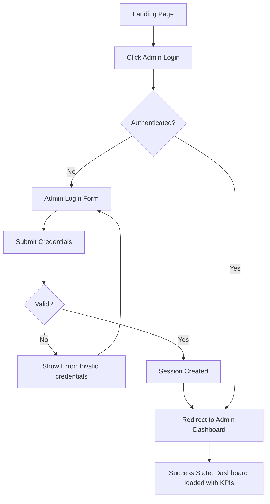
```mermaid
flowchart TD
    A[Landing Page] --> B[Click Admin Login]
    B --> C{Authenticated?}
    C -- No --> D[Admin Login Form]
    D --> E[Submit Credentials]
    E --> F{Valid?}
    F -- No --> G[Show Error: Invalid credentials]
    G --> D
    F -- Yes --> H[Session Created]
    H --> I[Redirect to Admin Dashboard]
    I --> J[Success State: Dashboard loaded with KPIs]
    C -- Yes --> I
```

### 3.5 Dashboard Flow

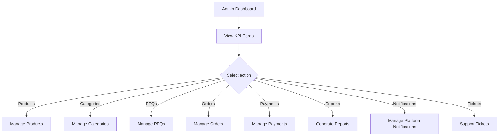
```mermaid
flowchart TD
    A[Admin Dashboard] --> B[View KPI Cards]
    B --> C{Select action}
    C -->|Products| D[Manage Products]
    C -->|Categories| E[Manage Categories]
    C -->|RFQs| F[Manage RFQs]
    C -->|Orders| G[Manage Orders]
    C -->|Payments| H[Manage Payments]
    C -->|Reports| I[Generate Reports]
    C -->|Notifications| J[Manage Platform Notifications]
    C -->|Tickets| K[Support Tickets]
```

### 3.6 Manage Products

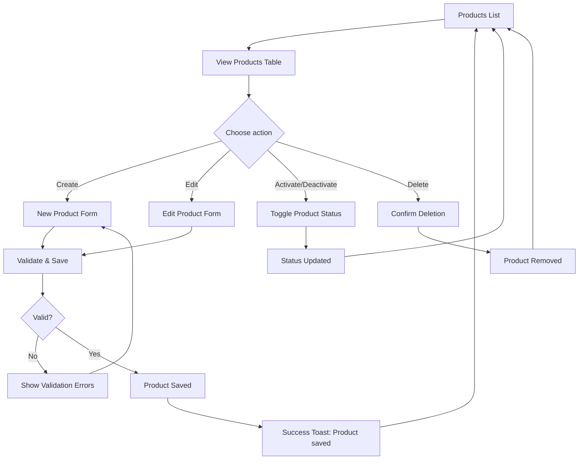
```mermaid
flowchart TD
    A[Products List] --> B[View Products Table]
    B --> C{Choose action}
    C -->|Create| D[New Product Form]
    C -->|Edit| E[Edit Product Form]
    C -->|Activate/Deactivate| F[Toggle Product Status]
    C -->|Delete| G[Confirm Deletion]
    D --> H[Validate & Save]
    E --> H
    H --> I{Valid?}
    I -- No --> J[Show Validation Errors]
    J --> D
    I -- Yes --> K[Product Saved]
    K --> L[Success Toast: Product saved]
    F --> M[Status Updated]
    G --> N[Product Removed]
    L --> A
    M --> A
    N --> A
```

### 3.7 Manage Categories

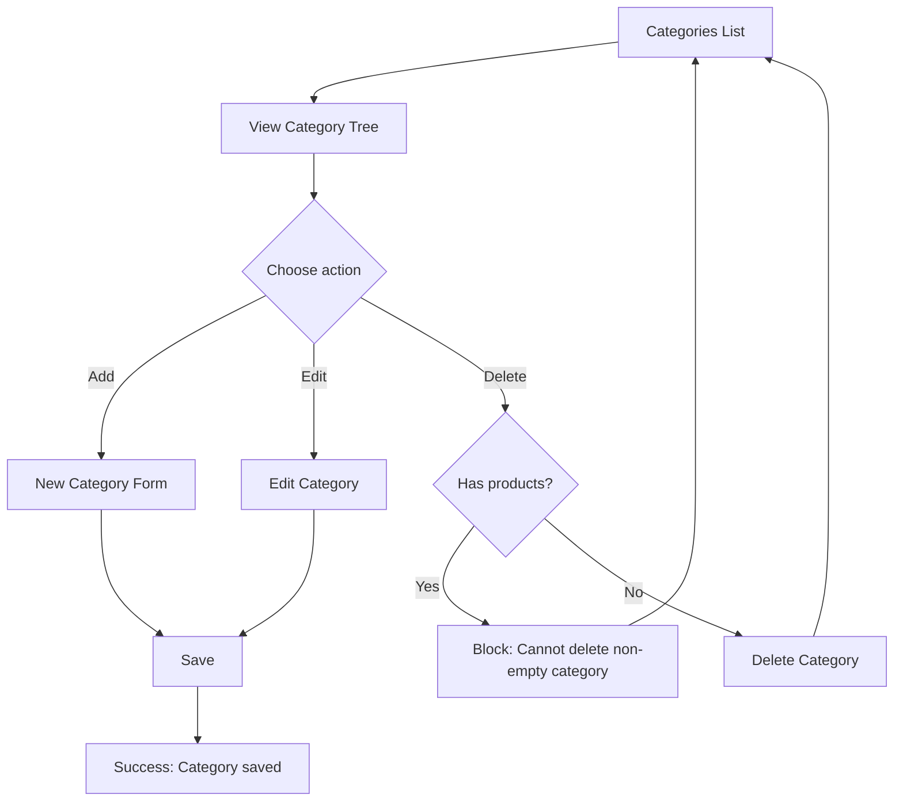
```mermaid
flowchart TD
    A[Categories List] --> B[View Category Tree]
    B --> C{Choose action}
    C -->|Add| D[New Category Form]
    C -->|Edit| E[Edit Category]
    C -->|Delete| F{Has products?}
    F -- Yes --> G[Block: Cannot delete non-empty category]
    F -- No --> H[Delete Category]
    D --> I[Save]
    E --> I
    I --> J[Success: Category saved]
    G --> A
    H --> A
```

### 3.8 Manage RFQs & Create Quotations

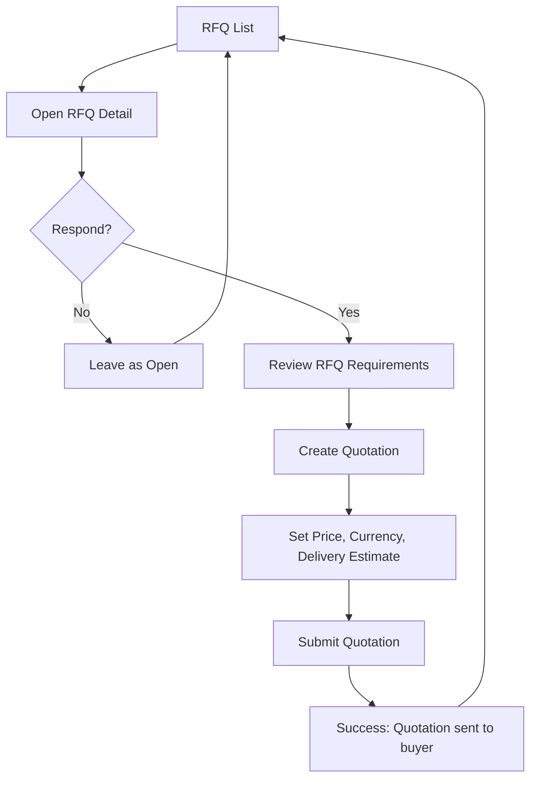
```mermaid
flowchart TD
    A[RFQ List] --> B[Open RFQ Detail]
    B --> C{Respond?}
    C -- No --> D[Leave as Open]
    C -- Yes --> E[Review RFQ Requirements]
    E --> F[Create Quotation]
    F --> G[Set Price, Currency, Delivery Estimate]
    G --> H[Submit Quotation]
    H --> I[Success: Quotation sent to buyer]
    D --> A
    I --> A
```

### 3.9 Manage Orders

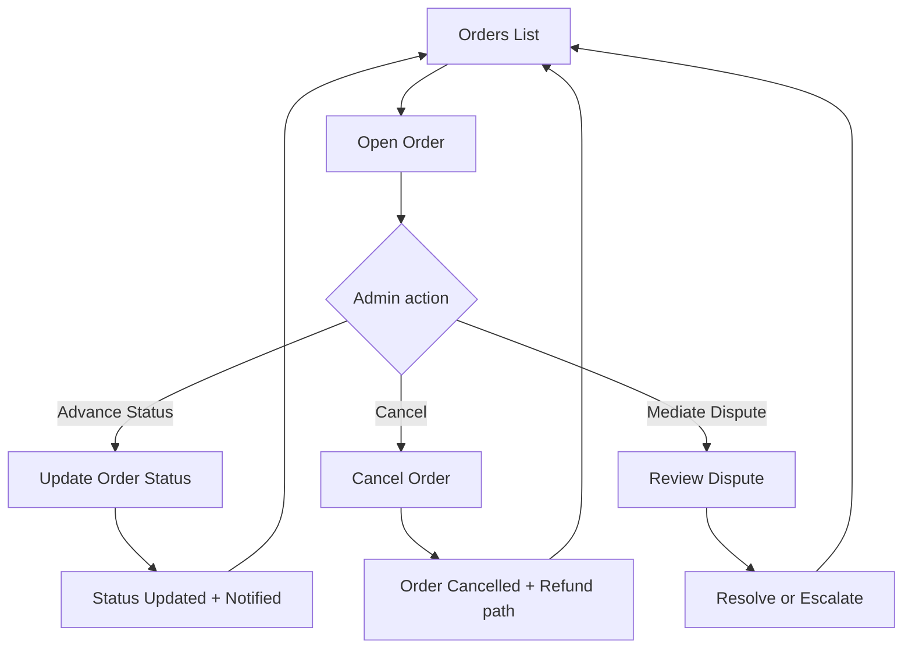
```mermaid
flowchart TD
    A[Orders List] --> B[Open Order]
    B --> C{Admin action}
    C -->|Advance Status| D[Update Order Status]
    C -->|Cancel| E[Cancel Order]
    C -->|Mediate Dispute| F[Review Dispute]
    D --> G[Status Updated + Notified]
    E --> H[Order Cancelled + Refund path]
    F --> I[Resolve or Escalate]
    G --> A
    H --> A
    I --> A
```

### 3.10 Update Shipment Status (Admin overrides)

- Admin can update shipment status as an override/fallback when no dedicated logistics action is taken.

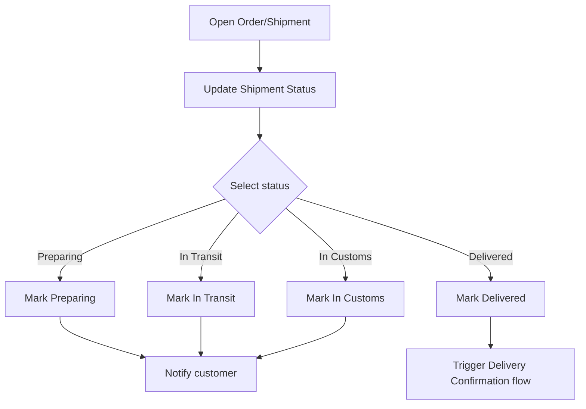
```mermaid
flowchart TD
    A[Open Order/Shipment] --> B[Update Shipment Status]
    B --> C{Select status}
    C -->|Preparing| D[Mark Preparing]
    C -->|In Transit| E[Mark In Transit]
    C -->|In Customs| F[Mark In Customs]
    C -->|Delivered| G[Mark Delivered]
    D --> H[Notify customer]
    E --> H
    F --> H
    G --> I[Trigger Delivery Confirmation flow]
```

### 3.11 Manage Customers

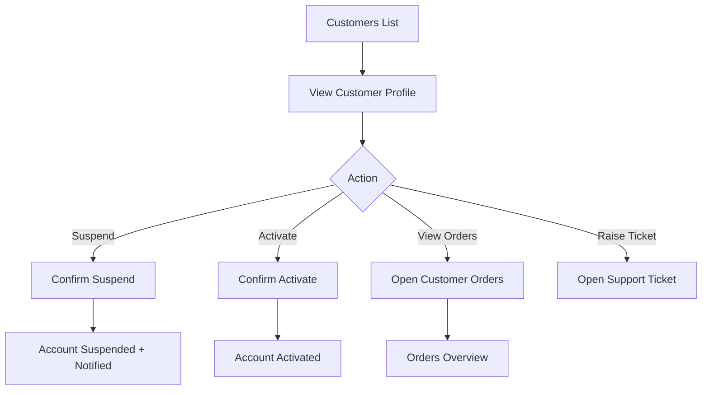
```mermaid
flowchart TD
    A[Customers List] --> B[View Customer Profile]
    B --> C{Action}
    C -->|Suspend| D[Confirm Suspend]
    C -->|Activate| E[Confirm Activate]
    C -->|View Orders| F[Open Customer Orders]
    C -->|Raise Ticket| G[Open Support Ticket]
    D --> H[Account Suspended + Notified]
    E --> I[Account Activated]
    F --> J[Orders Overview]
```

### 3.12 Manage Payments

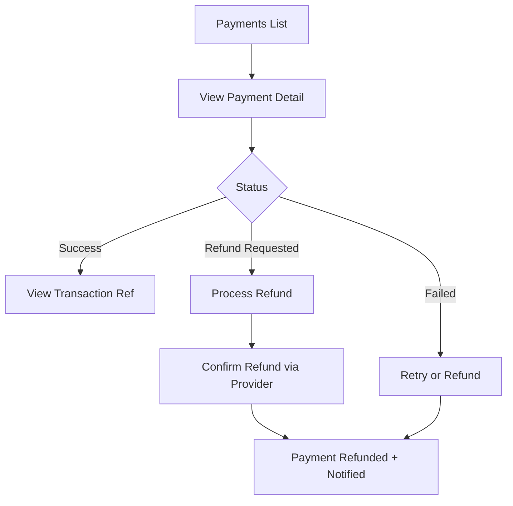
```mermaid
flowchart TD
    A[Payments List] --> B[View Payment Detail]
    B --> C{Status}
    C -->|Success| D[View Transaction Ref]
    C -->|Failed| E[Retry or Refund]
    C -->|Refund Requested| F[Process Refund]
    F --> G[Confirm Refund via Provider]
    G --> H[Payment Refunded + Notified]
    E --> H
```

### 3.13 Reports

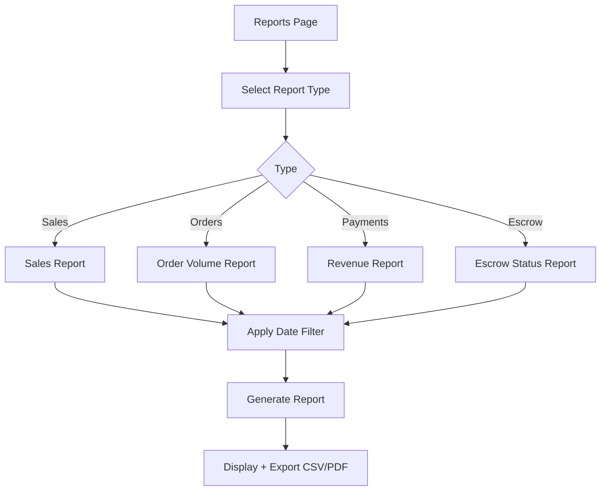
```mermaid
flowchart TD
    A[Reports Page] --> B[Select Report Type]
    B --> C{Type}
    C -->|Sales| D[Sales Report]
    C -->|Orders| E[Order Volume Report]
    C -->|Payments| F[Revenue Report]
    C -->|Escrow| G[Escrow Status Report]
    D --> H[Apply Date Filter]
    E --> H
    F --> H
    G --> H
    H --> I[Generate Report]
    I --> J[Display + Export CSV/PDF]
```

### 3.14 Notifications

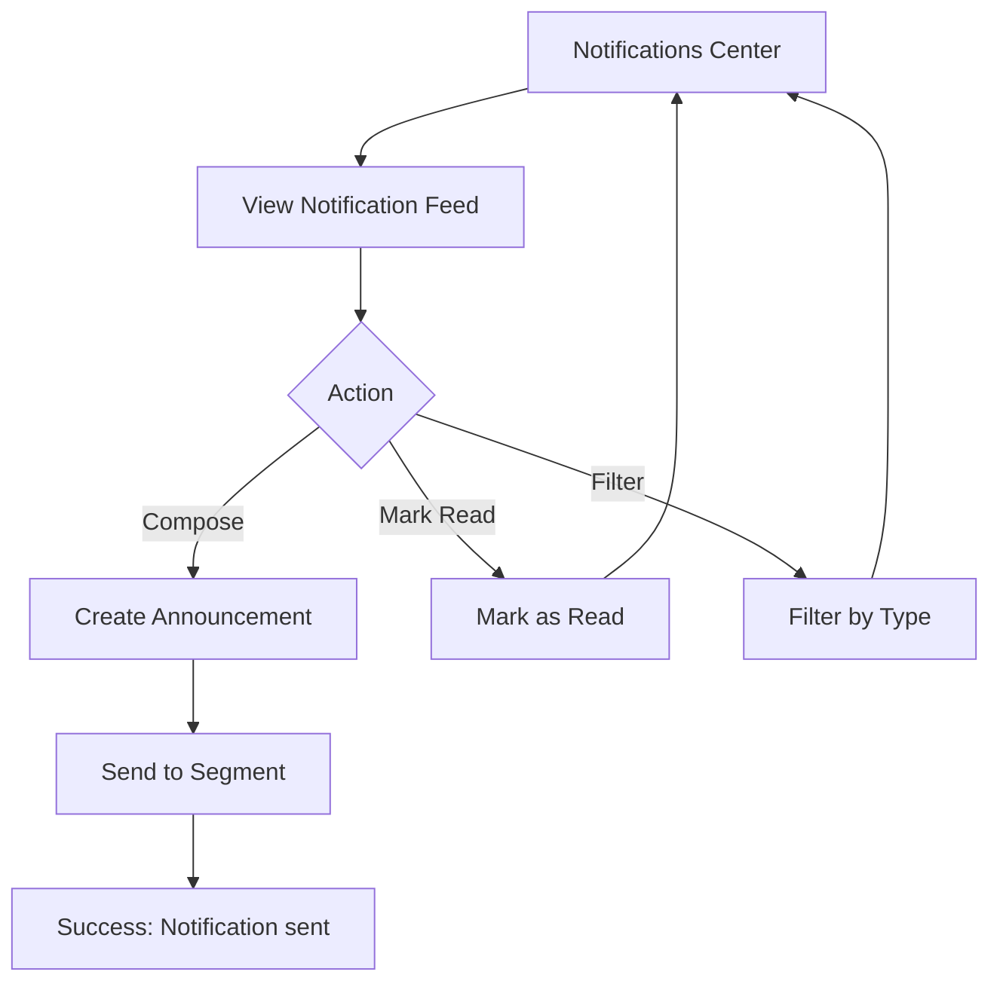
```mermaid
flowchart TD
    A[Notifications Center] --> B[View Notification Feed]
    B --> C{Action}
    C -->|Compose| D[Create Announcement]
    C -->|Mark Read| E[Mark as Read]
    C -->|Filter| F[Filter by Type]
    D --> G[Send to Segment]
    G --> H[Success: Notification sent]
    E --> A
    F --> A
```

### 3.15 Admin Success States

- KPI dashboard loads with up-to-date metrics.
- All CRUD actions confirm with success toasts.
- Status changes propagate to customer notifications.
- Reports generate and export successfully.

### 3.16 Admin Error States

- **403:** accessing a route without admin role.
- **Validation:** invalid product/category fields.
- **Delete blocked:** deleting a non-empty category.
- **Refund failure:** payment provider rejects refund → show error + retry.
- **Session expired:** redirect to admin login.

### 3.17 Admin Exit Points

- **Logout** → redirect to landing page.
- **Navigation** to any section.
- **Session timeout** expiry.

---

## Role 4 — Logistics Officer

### 4.1 Entry Point

- Logistics Officer logs in and lands on the **Shipments** dashboard.

### 4.2 Authentication Flow

- Email/password via Better Auth with `logistics` role.
- Session checked server-side; unauthorized → 403 redirect.

### 4.3 Main Navigation

- Assigned Shipments
- Pending Updates
- Upload Documents
- Delivered Shipments

### 4.4 View Assigned Shipments

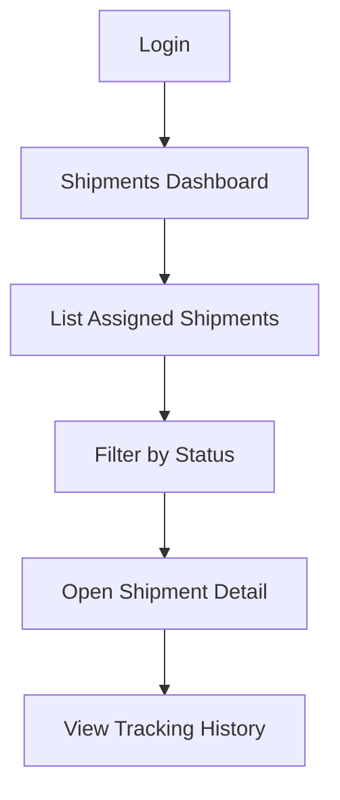
```mermaid
flowchart TD
    A[Login] --> B[Shipments Dashboard]
    B --> C[List Assigned Shipments]
    C --> D[Filter by Status]
    D --> E[Open Shipment Detail]
    E --> F[View Tracking History]
```

### 4.5 Update Shipment Status

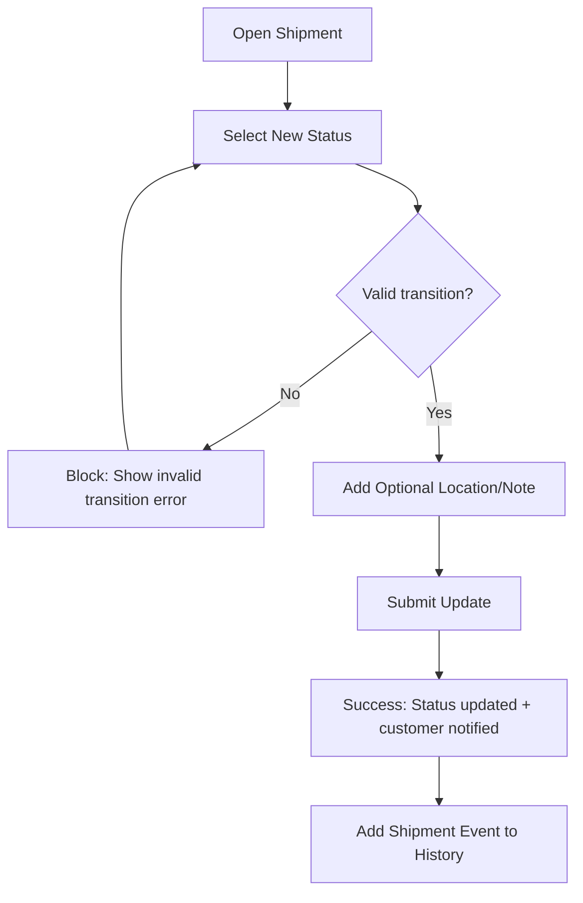
```mermaid
flowchart TD
    A[Open Shipment] --> B[Select New Status]
    B --> C{Valid transition?}
    C -- No --> D[Block: Show invalid transition error]
    D --> B
    C -- Yes --> E[Add Optional Location/Note]
    E --> F[Submit Update]
    F --> G[Success: Status updated + customer notified]
    G --> H[Add Shipment Event to History]
```

### 4.6 Upload Shipping Documents

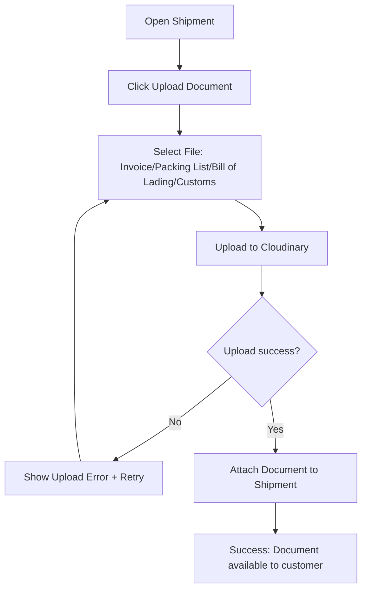
```mermaid
flowchart TD
    A[Open Shipment] --> B[Click Upload Document]
    B --> C[Select File: Invoice/Packing List/Bill of Lading/Customs]
    C --> D[Upload to Cloudinary]
    D --> E{Upload success?}
    E -- No --> F[Show Upload Error + Retry]
    F --> C
    E -- Yes --> G[Attach Document to Shipment]
    G --> H[Success: Document available to customer]
```

### 4.7 Mark Shipment Delivered

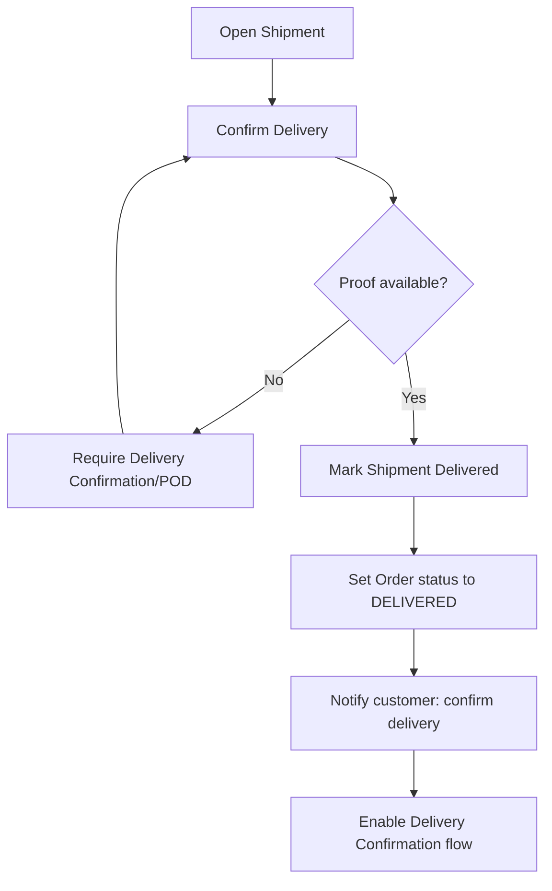
```mermaid
flowchart TD
    A[Open Shipment] --> B[Confirm Delivery]
    B --> C{Proof available?}
    C -- No --> D[Require Delivery Confirmation/POD]
    D --> B
    C -- Yes --> E[Mark Shipment Delivered]
    E --> F[Set Order status to DELIVERED]
    F --> G[Notify customer: confirm delivery]
    G --> H[Enable Delivery Confirmation flow]
```

### 4.8 Logistics Success States

- Shipment list reflects latest status.
- Customer is notified on every update.
- Documents are uploaded and visible.
- Delivery confirmation triggers order completion.

### 4.9 Logistics Error States

- **Invalid transition** on status change.
- **Upload failure** (size/type/network).
- **Missing proof of delivery** when marking delivered.
- **No assigned shipments** empty state.

### 4.10 Logistics Exit Points

- **Logout** → landing page.
- **Navigation** to other sections.
- **Session timeout.**

---

## Role 5 — Support Staff

### 5.1 Entry Point

- Support Staff logs in and lands on the **Support / Tickets** dashboard.

### 5.2 Authentication Flow

- Email/password via Better Auth with `support` role (provisioned by admin).
- Role guard enforced server-side.

### 5.3 Main Navigation

- Ticket Queue
- Open Tickets
- Respond to Ticket
- Escalated Tickets
- Closed Tickets

### 5.4 View Customer Requests

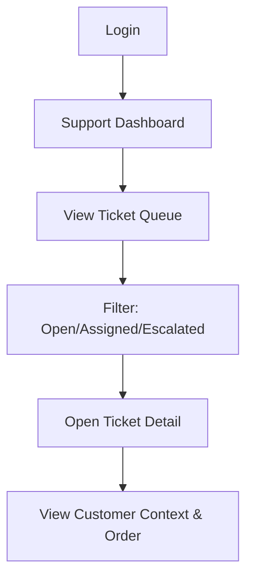
```mermaid
flowchart TD
    A[Login] --> B[Support Dashboard]
    B --> C[View Ticket Queue]
    C --> D[Filter: Open/Assigned/Escalated]
    D --> E[Open Ticket Detail]
    E --> F[View Customer Context & Order]
```

### 5.5 Respond to Tickets

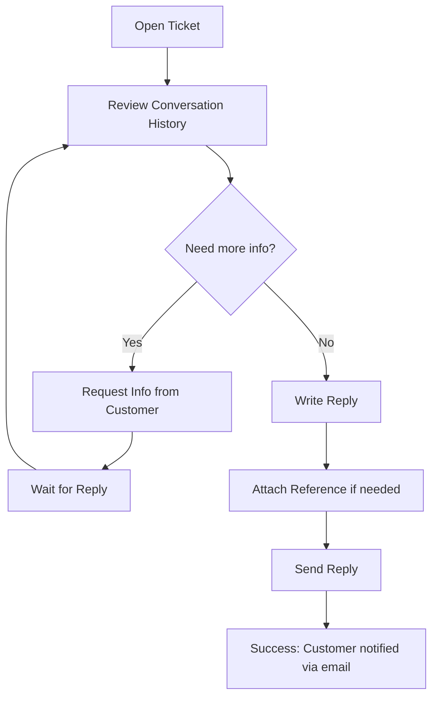
```mermaid
flowchart TD
    A[Open Ticket] --> B[Review Conversation History]
    B --> C{Need more info?}
    C -- Yes --> D[Request Info from Customer]
    D --> E[Wait for Reply]
    E --> B
    C -- No --> F[Write Reply]
    F --> G[Attach Reference if needed]
    G --> H[Send Reply]
    H --> I[Success: Customer notified via email]
```

### 5.6 Escalate Issues

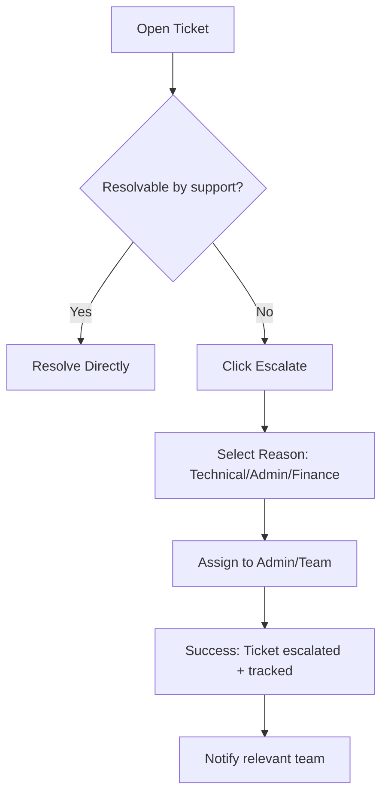
```mermaid
flowchart TD
    A[Open Ticket] --> B{Resolvable by support?}
    B -- Yes --> C[Resolve Directly]
    B -- No --> D[Click Escalate]
    D --> E[Select Reason: Technical/Admin/Finance]
    E --> F[Assign to Admin/Team]
    F --> G[Success: Ticket escalated + tracked]
    G --> H[Notify relevant team]
```

### 5.7 Close Tickets

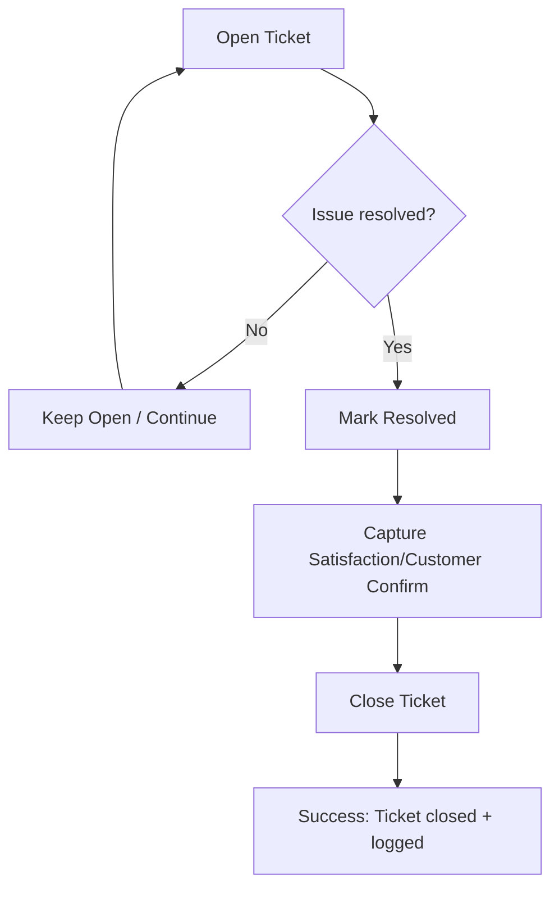
```mermaid
flowchart TD
    A[Open Ticket] --> B{Issue resolved?}
    B -- No --> C[Keep Open / Continue]
    C --> A
    B -- Yes --> D[Mark Resolved]
    D --> E[Capture Satisfaction/Customer Confirm]
    E --> F[Close Ticket]
    F --> G[Success: Ticket closed + logged]
```

### 5.8 Support Success States

- Customer receives replies promptly.
- Escalations are tracked and assigned.
- Closed tickets are archived for reference.
- Resolution status visible.

### 5.9 Support Error States

- **Ticket not found** (deleted/permission).
- **Send failure** on reply.
- **Escalation without assignee** → prompt to select team.
- **Closing without confirmation** → block/confirm.

### 5.10 Support Exit Points

- **Logout** → landing page.
- **Navigation** to other sections.
- **Session timeout.**

---

## Role 1 — Guest

### 1.1 Entry Point

- Guest arrives at the landing/home page (public).

### 1.2 Authentication Flow (Guest)

- Guest is **not authenticated**. They may authenticate by registering or logging in.

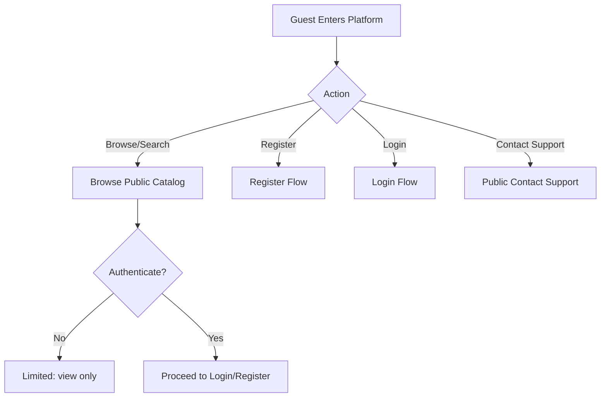
```mermaid
flowchart TD
    A[Guest Enters Platform] --> B{Action}
    B -->|Browse/Search| C[Browse Public Catalog]
    B -->|Register| D[Register Flow]
    B -->|Login| E[Login Flow]
    B -->|Contact Support| F[Public Contact Support]
    C --> G{Authenticate?}
    G -- No --> H[Limited: view only]
    G -- Yes --> I[Proceed to Login/Register]
```

### 1.3 Main Navigation (Guest)

- Home
- Products (browse/search)
- Categories
- About / How it works
- Login / Register
- Contact Support

### 1.4 Register Flow

```mermaid
flowchart TD
    A[Click Register] --> B[Registration Form]
    B --> C[Enter Name, Email, Password]
    C --> D[Choose Role: Buyer / Supplier]
    D --> E[Submit]
    E --> F{Validation}
    F -- No --> G[Show Errors: email in use, weak password]
    G --> B
    F -- Yes --> H[Create Account]
    H --> I[Send Verification Email]
    I --> J[Verify Email]
    J --> K[Success: Redirect to Dashboard]
```

### 1.5 Login Flow

```mermaid
flowchart TD
    A[Click Login] --> B[Login Form]
    B --> C[Enter Email + Password]
    C --> D{Authenticate}
    D -- No --> E[Show Error: Invalid credentials]
    E --> B
    D -- Yes --> F[Create Session]
    F --> G[Redirect by Role]
    G --> H[Buyer Dashboard]
    G --> I[Supplier Dashboard]
    G --> J[Admin Dashboard]
    G --> K[Logistics Dashboard]
```

### 1.6 Forgot Password Flow

```mermaid
flowchart TD
    A[Click Forgot Password] --> B[Enter Email]
    B --> C[Submit]
    C --> D[Send Reset Link via Email]
    D --> E[Open Link]
    E --> F[Set New Password]
    F --> G[Confirm Password]
    G --> H{Match & Valid?}
    H -- No --> I[Show Error]
    I --> F
    H -- Yes --> J[Password Updated]
    J --> K[Success: Redirect to Login]
```

### 1.7 Guest Exit Points

- **Without auth:** leaves after browsing.
- **With auth:** becomes a registered user.
- **Logout** (if logged in) → back to guest.

---

## Role 2 — Customer (Buyer)

### 2.1 Entry Point

- Customer logs in and lands on the **Buyer Dashboard**.

### 2.2 Authentication Flow

- Same as Login flow (section 1.5), routed to buyer dashboard on success.

### 2.3 Main Navigation (Buyer)

- Dashboard
- Browse Products
- My RFQs / Quotations
- My Orders
- Payments
- Shipment Tracking
- Reviews
- Support
- Profile / Settings

### 2.4 Browse Products

```mermaid
flowchart TD
    A[Catalog Page] --> B[View Product Grid]
    B --> C[Filter by Category]
    B --> D[Sort by Price/Rating]
    B --> E[Page through Results]
    C --> F[Updated Results]
    D --> F
    E --> F
    F --> G[Open Product]
```

### 2.5 Search Products

```mermaid
flowchart TD
    A[Search Bar] --> B[Enter Query]
    B --> C[Submit Search]
    C --> D[Fetch Matching Products]
    D --> E{Results?}
    E -- No --> F[Show Empty State: No matches]
    E -- Yes --> G[Show Results List]
    G --> H[Apply Filters/Sort]
    F --> I[Suggest Alternatives/Popular Items]
```

### 2.6 View Product

```mermaid
flowchart TD
    A[Product in List] --> B[Open Product Detail]
    B --> C[View Images (Cloudinary)]
    B --> D[View Price, MOQ, Supplier]
    C --> E{Action}
    D --> E
    E -->|Request Quote| F[RFQ Flow]
    E -->|Contact Supplier| G[Contact Supplier]
    E -->|Add to Watchlist| H[Save Product]
```

### 2.7 Request a Quote (RFQ)

```mermaid
flowchart TD
    A[Click Request Quote] --> B[RFQ Form]
    B --> C[Enter Product, Quantity, Destination]
    C --> D[Add Requirements/Notes]
    D --> E[Submit RFQ]
    E --> F{Valid?}
    F -- No --> G[Show Errors]
    G --> B
    F -- Yes --> H[RFQ Published]
    H --> I[Notify Suppliers]
    I --> J[Success: RFQ open & awaiting quotes]
```

### 2.8 Receive Quote

```mermaid
flowchart TD
    A[RFQ Open] --> B[Supplier Submits Quotation]
    B --> C[Notify Buyer]
    C --> D[Buyer Views Quote in RFQ Detail]
    D --> E[Compare Multiple Quotes]
    E --> F{Decision}
```

### 2.9 Accept or Reject Quote

```mermaid
flowchart TD
    A[View Quotation] --> B{Decision}
    B -->|Accept| C[Confirm Acceptance]
    C --> D{Valid?}
    D -- No --> E[Show Error: quote expired]
    E --> A
    D -- Yes --> F[Create Order]
    F --> G[Success: Order created, quote accepted]
    B -->|Reject| H[Confirm Rejection]
    H --> I[Notify Supplier]
    I --> J[RFQ reopens/adjusts]
```

### 2.10 Make Payment

```mermaid
flowchart TD
    A[Order Created] --> B[Review Order Summary]
    B --> C[Select Payment Method]
    C --> D{Provider}
    D -->|Paystack| E[Paystack Checkout]
    D -->|Flutterwave| F[Flutterwave Checkout]
    E --> G[Complete Payment]
    F --> G
    G --> H{Success?}
    H -- No --> I[Payment Failed: Retry/Change method]
    I --> B
    H -- Yes --> J[Payment Confirmed]
    J --> K[Funds Held in Escrow]
    K --> L[Success: Order marked PAID]
```

### 2.11 Order Processing

```mermaid
flowchart TD
    A[Order PAID] --> B[Escrow Held]
    B --> C[Supplier Begins Production]
    C --> D[Status: IN_PRODUCTION]
    D --> E[Ready to Ship]
    E --> F[Status: READY_TO_SHIP]
    F --> G[Await Shipment]
```

### 2.12 Shipment Tracking

```mermaid
flowchart TD
    A[Order in My Orders] --> B[Open Shipment Tracker]
    B --> C[Live Timeline of Events]
    C --> D[Status: IN_TRANSIT]
    D --> E[Status: IN_CUSTOMS]
    E --> F[Status: OUT_FOR_DELIVERY]
    F --> G[Arrived at Destination]
```

### 2.13 Delivery Confirmation

```mermaid
flowchart TD
    A[Shipment Marked Delivered] --> B[Prompt Customer to Confirm]
    B --> C{Customer confirms?}
    C -- No --> D[Raise Issue/Dispute]
    D --> E[Customer Support Escalation]
    C -- Yes --> F[Confirm Delivery]
    F --> G[Release Escrow to Supplier]
    G --> H[Order COMPLETED]
    H --> I[Enable Review]
```

### 2.14 Leave Review

```mermaid
flowchart TD
    A[Order Completed] --> B[Prompt for Review]
    B --> C[Rate Product/Supplier]
    C --> D[Write Comment]
    D --> E[Submit Review]
    E --> F{Valid?}
    F -- No --> G[Show Error]
    G --> C
    F -- Yes --> H[Review Published]
    H --> I[Success: Review visible]
```

### 2.15 Contact Support

```mermaid
flowchart TD
    A[Click Support] --> B[Open Ticket Form]
    B --> C[Select Category: Order/Payment/Shipping/Other]
    C --> D[Describe Issue]
    D --> E[Attach Screenshots if needed]
    E --> F[Submit Ticket]
    F --> G[Ticket Created]
    G --> H[Success: Notified via email]
    H --> I[Track in Support Dashboard]
```

### 2.16 Customer Success States

- Account verified & logged in.
- RFQ published and quotes received.
- Order created, paid, escrow held.
- Shipment tracked through delivery.
- Escrow released, order completed.
- Review published.
- Support ticket opened & tracked.

### 2.17 Customer Error States

- **Registration:** email in use / weak password.
- **Login:** invalid credentials.
- **Payment:** declined / network error → retry.
- **Quote expired** when accepting.
- **Delivery issue** → dispute path.
- **Upload/attachment** failure on support.

### 2.18 Customer Exit Points

- **Logout** → landing page.
- **Session timeout.**
- **Leaves** after browsing.

---

## 6. Dependencies Between Flows

The flows are highly interdependent. Key dependencies:

```mermaid
flowchart LR
    A[Register] --> B[Login]
    B --> C[Browse/Search Products]
    C --> D[View Product]
    D --> E[Request RFQ]
    E --> F[Receive Quote]
    F --> G[Accept Quote]
    G --> H[Create Order]
    H --> I[Make Payment]
    I --> J[Escrow Held]
    J --> K[Order Processing]
    K --> L[Shipment Created]
    L --> M[Shipment Tracking]
    M --> N[Delivery Confirmation]
    N --> O[Escrow Released]
    O --> P[Order Completed]
    P --> Q[Leave Review]
```

Support dependencies:

- **Admin Create Quotation** depends on **Buyer Request RFQ**.
- **Logistics Update Shipment** depends on **Order Paid**.
- **Support Tickets** reference orders/payments/shipments.
- **Escrow Release** depends on **Delivery Confirmation** (or admin override).

---

## 7. UX Bottlenecks & Opportunities

### 7.1 Bottlenecks

1. **Supplier Verification (Admin gate):** buyers cannot order from unverified suppliers → risk of delayed supplier activation. _Mitigation:_ clear status messaging + fast-track admin queue.
2. **Escrow Release depends on manual delivery confirmation:** if customer doesn't confirm, supplier payment is delayed. _Mitigation:_ auto-release fallback after X days unless disputed.
3. **Quote Expiry:** buyer may lose a good quote if they wait. _Mitigation:_ quoting countdown + reminder notifications.
4. **Payment depth:** multiple providers increase failure surface. _Mitigation:_ unified error handling + retry guidance.
5. **Ticket handoff:** support → admin escalation can stall. _Mitigation:_ SLA timers + priority routing.

### 7.2 Opportunities

1. **Progressive onboarding:** allow guests to create RFQs before full verification to reduce drop-off.
2. **Guided checkout wizard:** reduce multi-step payment/order friction.
3. **Real-time shipment map** for improved tracking UX.
4. **In-app notifications + email** for every state change.
5. **Proactive support widget** with context (order/shipment) pre-filled.
6. **Review incentives** post-completion to build trust signals.
7. **Empty states & helpful error messages** throughout to guide users.

---

## 8. Cross-Role Summary

| Journey Stage    | Primary Role     | Supporting Roles       |
| ---------------- | ---------------- | ---------------------- |
| Discover         | Guest / Customer | —                      |
| Source (RFQ)     | Customer         | Admin (create quote)   |
| Order & Pay      | Customer         | Admin (payments)       |
| Produce          | Supplier         | Admin                  |
| Ship             | Logistics        | Admin (override)       |
| Confirm & Review | Customer         | Admin (escrow release) |
| Support          | Support Staff    | Admin (escalation)     |

---

## 9. Appendix: Flow Coverage Matrix

| Required Flow                      | Documented In |
| ---------------------------------- | ------------- |
| Register                           | 1.4           |
| Login                              | 1.5           |
| Forgot Password                    | 1.6           |
| Browse Products                    | 2.4           |
| Search Products                    | 2.5           |
| View Product                       | 2.6           |
| Request Quote (RFQ)                | 2.7           |
| Receive Quote                      | 2.8           |
| Accept/Reject Quote                | 2.9           |
| Make Payment                       | 2.10          |
| Order Processing                   | 2.11          |
| Shipment Tracking                  | 2.12          |
| Delivery Confirmation              | 2.13          |
| Leave Review                       | 2.14          |
| Contact Support                    | 2.15          |
| Admin Login                        | 3.4           |
| Admin Dashboard                    | 3.5           |
| Manage Products                    | 3.6           |
| Manage Categories                  | 3.7           |
| Manage RFQs                        | 3.8           |
| Create Quotations                  | 3.8           |
| Manage Orders                      | 3.9           |
| Update Shipment Status             | 3.10          |
| Manage Customers                   | 3.11          |
| Manage Payments                    | 3.12          |
| Reports                            | 3.13          |
| Notifications                      | 3.14          |
| View Assigned Shipments            | 4.4           |
| Update Shipment Status (Logistics) | 4.5           |
| Upload Shipping Documents          | 4.6           |
| Mark Shipment Delivered            | 4.7           |
| View Customer Requests             | 5.4           |
| Respond to Tickets                 | 5.5           |
| Escalate Issues                    | 5.6           |
| Close Tickets                      | 5.7           |

---

_End of User Flow Document — Sprint 0.5._
</content>
